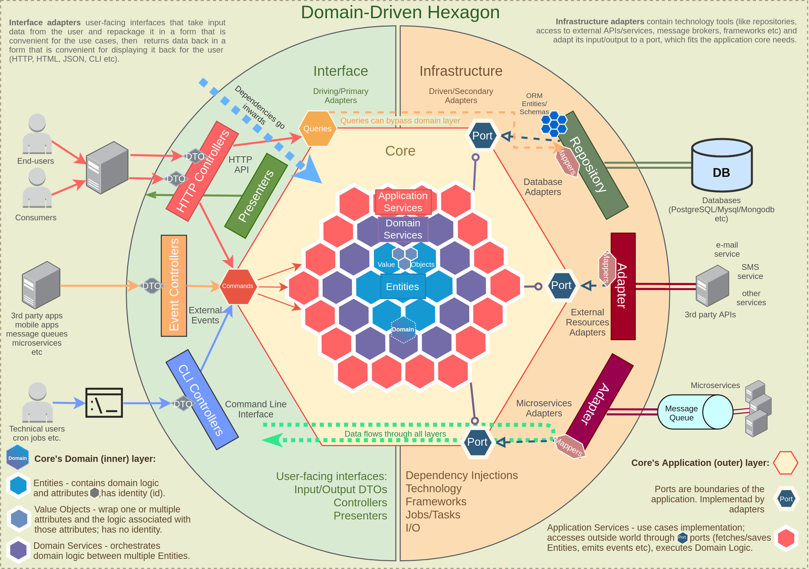

# Domain-Driven Hexagon

**Check out my other repositories**:

- [Backend best practices](https://github.com/Sairyss/backend-best-practices) - Best practices, tools and guidelines for backend development.
- [System Design Patterns](https://github.com/Sairyss/system-design-patterns) - list of topics and resources related to distributed systems, system design, microservices, scalability and performance, etc.
- [Full Stack starter template](https://github.com/Sairyss/fullstack-starter-template) - template for full stack applications based on TypeScript, React, Vite, ChakraUI, tRPC, Fastify, Prisma, zod, etc.

---

The main emphasis of this project is to provide recommendations on how to design software applications. This readme includes techniques, tools, best practices, architectural patterns and guidelines gathered from different sources.

Code examples are written using [NodeJS](https://nodejs.org/en/), [TypeScript](https://www.typescriptlang.org/), [NestJS](https://docs.nestjs.com/) framework and [Slonik](https://github.com/gajus/slonik) for the database access.

Patterns and principles presented here are **framework/language agnostic**. Therefore, the above technologies can be easily replaced with any alternative. No matter what language or framework is used, any application can benefit from principles described below.

**Note**: code examples are adapted to TypeScript and frameworks mentioned above. <br/>
(Implementations in other languages will look differently)

**Everything below is provided as a recommendation, not a rule**. Different projects have different requirements, so any pattern mentioned in this readme should be adjusted to project needs or even skipped entirely if it doesn't fit. In real world production applications, you will most likely only need a fraction of those patterns depending on your use cases. More info in [this](#general-recommendations-on-architectures-best-practices-design-patterns-and-principles) section.

---

- [Domain-Driven Hexagon](#domain-driven-hexagon)
- [Architecture](#architecture)
      - [Pros](#pros)
      - [Cons](#cons)
- [Diagram](#diagram)
- [Modules](#modules)
- [Application Core](#application-core)
- [Application layer](#application-layer)
  - [Application Services](#application-services)
  - [Commands and Queries](#commands-and-queries)
    - [Commands](#commands)
    - [Queries](#queries)
  - [Ports](#ports)
- [Domain Layer](#domain-layer)
  - [Entities](#entities)
  - [Aggregates](#aggregates)
  - [Domain Events](#domain-events)
  - [Integration Events](#integration-events)
  - [Domain Services](#domain-services)
  - [Value objects](#value-objects)
  - [Domain Invariants](#domain-invariants)
    - [Replacing primitives with Value Objects](#replacing-primitives-with-value-objects)
    - [Make illegal states unrepresentable](#make-illegal-states-unrepresentable)
      - [Validation at compile time](#validation-at-compile-time)
      - [Validation at runtime](#validation-at-runtime)
    - [Guarding vs validating](#guarding-vs-validating)
  - [Domain Errors](#domain-errors)
  - [Using libraries inside Application's core](#using-libraries-inside-applications-core)
- [Interface Adapters](#interface-adapters)
  - [Controllers](#controllers)
    - [Resolvers](#resolvers)
  - [DTOs](#dtos)
    - [Request DTOs](#request-dtos)
    - [Response DTOs](#response-dtos)
    - [Additional recommendations](#additional-recommendations)
    - [Local DTOs](#local-dtos)
- [Infrastructure layer](#infrastructure-layer)
  - [Adapters](#adapters)
  - [Repositories](#repositories)
  - [Persistence models](#persistence-models)
  - [Other things that can be a part of Infrastructure layer](#other-things-that-can-be-a-part-of-infrastructure-layer)
- [Other recommendations](#other-recommendations)
  - [General recommendations on architectures, best practices, design patterns and principles](#general-recommendations-on-architectures-best-practices-design-patterns-and-principles)
  - [Recommendations for smaller APIs](#recommendations-for-smaller-apis)
  - [Behavioral Testing](#behavioral-testing)
  - [Folder and File Structure](#folder-and-file-structure)
    - [File names](#file-names)
  - [Enforcing architecture](#enforcing-architecture)
  - [Prevent massive inheritance chains](#prevent-massive-inheritance-chains)
- [Additional resources](#additional-resources)
  - [Articles](#articles)
  - [Websites](#websites)
  - [Blogs](#blogs)
  - [Videos](#videos)
  - [Books](#books)

# Architecture

This is an attempt to combine multiple architectural patterns and styles together, such as:

- [Domain-Driven Design (DDD)](https://en.wikipedia.org/wiki/Domain-driven_design)
- [Hexagonal (Ports and Adapters) Architecture](https://en.wikipedia.org/wiki/Hexagonal_architecture_(software))
- [Secure by Design](https://www.manning.com/books/secure-by-design)
- [Clean Architecture](https://blog.cleancoder.com/uncle-bob/2012/08/13/the-clean-architecture.html)
- [Onion Architecture](https://herbertograca.com/2017/09/21/onion-architecture/)
- [SOLID Principles](https://en.wikipedia.org/wiki/SOLID)
- [Software Design Patterns](https://refactoring.guru/design-patterns/what-is-pattern)

And many others (more links below in every chapter).

Before we begin, here are the PROS and CONS of using a complete architecture like this:

#### Pros

- Independent of external frameworks, technologies, databases, etc. Frameworks and external resources can be plugged/unplugged with much less effort.
- Easily testable and scalable.
- More secure. Some security principles are baked in design itself.
- The solution can be worked on and maintained by different teams, without stepping on each other's toes.
- Easier to add new features. As the system grows over time, the difficulty in adding new features remains constant and relatively small.
- If the solution is properly broken apart along [bounded context](https://martinfowler.com/bliki/BoundedContext.html) lines, it becomes easy to convert pieces of it into microservices if needed.

#### Cons

- This is a sophisticated architecture which requires a firm understanding of quality software principles, such as SOLID, Clean/Hexagonal Architecture, Domain-Driven Design, etc. Any team implementing such a solution will almost certainly require an expert to drive the solution and keep it from evolving the wrong way and accumulating technical debt.

- Some practices presented here are not recommended for small-medium sized applications with not a lot of business logic. There is added up-front complexity to support all those building blocks and layers, boilerplate code, abstractions, data mapping etc. Thus, implementing a complete architecture like this is generally ill-suited to simple [CRUD](https://en.wikipedia.org/wiki/Create,_read,_update_and_delete) applications and could over-complicate such solutions. Some principles which are described below can be used in smaller sized applications, but must be implemented only after analyzing and understanding all pros and cons.

# Diagram


<sup>Diagram is mostly based on [this one](https://github.com/hgraca/explicit-architecture-php#explicit-architecture-1) + others found online</sup>

In short, data flow looks like this (from left to right):

- Request/CLI command/event is sent to the controller using plain DTO;
- Controller parses this DTO, maps it to a Command/Query object format and passes it to an Application service;
- Application service handles this Command/Query; it executes business logic using domain services and entities/aggregates and uses the infrastructure layer through ports(interfaces);
- Infrastructure layer maps data to a format that it needs, retrieves/persists data from/to a database, uses adapters for other I/O communications (like sending an event to an external broker or calling external APIs), maps data back to domain format and returns it back to Application service;
- After the Application service finishes doing its job, it returns data/confirmation back to Controllers;
- Controllers return data back to the user (if application has presenters/views, those are returned instead).

Each layer is in charge of its own logic and has building blocks that usually should follow a [Single-responsibility principle](https://en.wikipedia.org/wiki/Single-responsibility_principle) when possible and when it makes sense (for example, using `Repositories` only for database access, using `Entities` for business logic, etc.).

**Keep in mind** that different projects can have more or less steps/layers/building blocks than described here. Add more if the application requires it, and skip some if the application is not that complex and doesn't need all that abstraction.

General recommendation for any project: analyze how big/complex the application will be, find a compromise and use as many layers/building blocks as needed for the project and skip ones that may over-complicate things.

More in details on each step below.

# Modules

This project's code examples use separation by modules (also called components). Each module's name should reflect an important concept from the Domain and have its own folder with a dedicated codebase. Each business use case inside that module gets its own folder to store most of the things it needs (this is also called _Vertical Slicing_). It's easier to work on things that change together if those things are gathered relatively close to each other. Think of a module as a "box" that groups together related business logic.

Using modules is a great way to [encapsulate](<https://en.wikipedia.org/wiki/Encapsulation_(computer_programming)>) parts of highly [cohesive](<https://en.wikipedia.org/wiki/Cohesion_(computer_science)>) business domain rules.

Try to make every module independent and keep interactions between modules minimal. Think of each module as a mini application bounded by a single context. Consider module internals private and try to avoid direct imports between modules (like importing a class `import SomeClass from '../SomeOtherModule'`) since this creates [tight coupling](<https://en.wikipedia.org/wiki/Coupling_(computer_programming)>) and can turn your code into a [spaghetti](https://en.wikipedia.org/wiki/Spaghetti_code) and application into a [big ball of mud](https://en.wikipedia.org/wiki/Big_ball_of_mud).

Few advices to avoid coupling:

- Try not to create dependencies between modules or use cases. Instead, move shared logic into a separate files and make both depend on that instead of depending on each other.
- Modules can cooperate through a [mediator](https://en.wikipedia.org/wiki/Mediator_pattern#:~:text=In%20software%20engineering%2C%20the%20mediator,often%20consist%20of%20many%20classes.) or a public [facade](https://en.wikipedia.org/wiki/Facade_pattern), hiding all private internals of the module to avoid its misuse, and giving public access only to certain pieces of functionality that meant to be public.
- Alternatively modules can communicate with each other by using messages. For example, you can send commands using a commands bus or subscribe to events that other modules emit (more info on events and commands bus below).

This ensures [loose coupling](https://en.wikipedia.org/wiki/Loose_coupling), refactoring of a module internals can be done easier because outside world only depends on module's public interface, and if bounded contexts are defined and designed properly each module can be easily separated into a microservice if needed without touching any domain logic or major refactoring.

Keep your modules small. You should be able to rewrite a module in a relatively short period of time. This applies not only to modules pattern, but to software development in general: objects, functions, microservices, processes, etc. Keep them small and composable. This is incredibly powerful in a constantly changing environments of software development, since when your requirements change, changing small modules is much easier than changing a big program. You can just delete a module and rewrite it from scratch in a matter of days. This idea is further described in this talk: [Greg Young - The art of destroying software](https://youtu.be/Ed94CfxgsCA).

Code Examples:

- Check [src/modules](src/modules) directory structure.
- [src/modules/user/commands](src/modules/user/commands) - "commands" directory in a user module includes business use cases (commands) that a module can execute, each with its own Vertical Slice.

Read more:

- [Modular programming: Beyond the spaghetti mess](https://www.tiny.cloud/blog/modular-programming-principle/).
- [What are Modules in Domain Driven Design?](https://www.culttt.com/2014/12/10/modules-domain-driven-design/)
- [How to Implement Vertical Slice Architecture](https://garywoodfine.com/implementing-vertical-slice-architecture/)

Each module consists of layers described below.

# Application Core

This is the core of the system which is built using [DDD building blocks](https://dzone.com/articles/ddd-part-ii-ddd-building-blocks):

**Domain layer**:

- Entities
- Aggregates
- Domain Services
- Value Objects
- Domain Errors

**Application layer**:

- Application Services
- Commands and Queries
- Ports

**Note**: different implementations may have slightly different layer structures depending on applications needs. Also, more layers and building blocks may be added if needed.

---

# Application layer

## Application Services

Application Services (also called "Workflow Services", "Use Cases", "Interactors", etc.) are used to orchestrate the steps required to fulfill the commands imposed by the client.

Application services:

- Typically used to orchestrate how the outside world interacts with your application and performs tasks required by the end users;
- Contain no domain-specific business logic;
- Operate on scalar types, transforming them into Domain types. A scalar type can be considered any type that's unknown to the Domain Model. This includes primitive types and types that don't belong to the Domain;
- Uses ports to declare dependencies on infrastructural services/adapters required to execute domain logic (ports are just interfaces, we will discuss this topic in details below);
- Fetch domain `Entities`/`Aggregates` (or anything else) from database/external APIs (through ports/interfaces, with concrete implementations injected by the [DI](https://en.wikipedia.org/wiki/Dependency_injection) library);
- Execute domain logic on those `Entities`/`Aggregates` (by invoking their methods);
- In case of working with multiple `Entities`/`Aggregates`, use a `Domain Service` to orchestrate them;
- Execute other out-of-process communications through Ports (like event emits, sending emails, etc.);
- Services can be used as a `Command`/`Query` handlers;
- Should not depend on other application services since it may cause problems (like cyclic dependencies);

One service per use case is considered a good practice.

<details>
<summary>What are "Use Cases"?</summary>

[wiki](https://en.wikipedia.org/wiki/Use_case):

> In software and systems engineering, a use case is a list of actions or event steps typically defining the interactions between a role (known in the Unified Modeling Language as an actor) and a system to achieve a goal.

Use cases are, simply said, list of actions required from an application.

---

</details>

Example file: [create-user.service.ts](src/modules/user/commands/create-user/create-user.service.ts)

More about services:

- [Domain-Application-Infrastructure Services pattern](https://badia-kharroubi.gitbooks.io/microservices-architecture/content/patterns/tactical-patterns/domain-application-infrastructure-services-pattern.html)
- [Services in DDD finally explained](https://developer20.com/services-in-ddd-finally-explained/)

## Commands and Queries

This principle is called [Command–Query Separation(CQS)](https://en.wikipedia.org/wiki/Command%E2%80%93query_separation). When possible, methods should be separated into `Commands` (state-changing operations) and `Queries` (data-retrieval operations). To make a clear distinction between those two types of operations, input objects can be represented as `Commands` and `Queries`. Before DTO reaches the domain, it's converted into a `Command`/`Query` object.

### Commands

`Command` is an object that signals user intent, for example `CreateUserCommand`. It describes a single action (but does not perform it).

`Commands` are used for state-changing actions, like creating new user and saving it to the database. Create, Update and Delete operations are considered as state-changing.

Data retrieval is responsibility of `Queries`, so `Command` methods should not return business data.

Some CQS purists may say that a `Command` shouldn't return anything at all. But you will need at least an ID of a created item to access it later. To achieve that you can let clients generate a [UUID](https://en.wikipedia.org/wiki/Universally_unique_identifier) (more info here: [CQS versus server generated IDs](https://blog.ploeh.dk/2014/08/11/cqs-versus-server-generated-ids/)).

Though, violating this rule and returning some metadata, like `ID` of a created item, redirect link, confirmation message, status, or other metadata is a more practical approach than following dogmas.

**Note**: `Command` is similar but not the same as described here: [Command Pattern](https://refactoring.guru/design-patterns/command). There are multiple definitions across the internet with similar but slightly different implementations.

To execute a command you can use a `Command Bus` instead of importing a service directly. This will decouple a command Invoker from a Receiver, so you can send your commands from anywhere without creating coupling.

Avoid command handlers executing other commands in this fashion: Command → Command. Instead, use events for that purpose, and execute next commands in a chain in an Event handler: Command → Event → Command.

Example files:

- [create-user.command.ts](src/modules/user/commands/create-user/create-user.command.ts) - a command Object
- [create-user.message.controller.ts](src/modules/user/commands/create-user/create-user.message.controller.ts) - controller executes a command using a command bus. This decouples it from a command handler.
- [create-user.service.ts](src/modules/user/commands/create-user/create-user.service.ts) - a command handler.

Read more:

- [What is a command bus and why should you use it?](https://barryvanveen.nl/blog/49-what-is-a-command-bus-and-why-should-you-use-it)
- [Why You Should Avoid Command Handlers Calling Other Commands?](https://www.rahulpnath.com/blog/avoid-commands-calling-commands/)

### Queries

`Query` is similar to a `Command`. It belongs to a read model and signals user intent to find something and describes how to do it.

`Query` is just a data retrieval operation and should not make any state changes (like writes to the database, files, third party APIs, etc.). For this reason, in read model we can bypass a domain and repository layers completely and query database directly from a query handler.

Similarly to Commands, Queries can use a `Query Bus` if needed. This way you can query anything from anywhere without importing classes directly and avoid coupling.

Example files:

- [find-users.query-handler.ts](src/modules/user/queries/find-users/find-users.query-handler.ts) - a query handler. Notice how we query the database directly, without using domain objects or repositories (more info [here](https://codeopinion.com/should-you-use-the-repository-pattern-with-cqrs-yes-and-no/)).

---

By enforcing `Command` and `Query` separation, the code becomes simpler to understand. One changes something, another just retrieves data.

Also, following CQS from the start will facilitate separating write and read models into different databases if someday in the future the need for it arises.

**Note**: this repo uses [NestJS CQRS](https://docs.nestjs.com/recipes/cqrs) package that provides a command/query bus.

Read more about CQS and CQRS:

- [Command Query Segregation](https://khalilstemmler.com/articles/oop-design-principles/command-query-segregation/).
- [Exposing CQRS Through a RESTful API](https://www.infoq.com/articles/rest-api-on-cqrs/)
- [What is the CQRS pattern?](https://docs.microsoft.com/en-us/azure/architecture/patterns/cqrs)
- [CQRS and REST: the perfect match](https://lostechies.com/jimmybogard/2016/06/01/cqrs-and-rest-the-perfect-match/)

---

## Ports

Ports are interfaces that define contracts that should be implemented by adapters. For example, a port can abstract technology details (like what type of database is used to retrieve some data), and infrastructure layer can implement an adapter in order to execute some action more related to technology details rather than business logic. Ports act like [abstractions](<https://en.wikipedia.org/wiki/Abstraction_(computer_science)>) for technology details that business logic does not care about. Name "port" most actively is used in [Hexagonal Architecture](<https://en.wikipedia.org/wiki/Hexagonal_architecture_(software)>).

In Application Core **dependencies point inwards**. Outer layers can depend on inner layers, but inner layers never depend on outer layers. Application Core shouldn't depend on frameworks or access external resources directly. Any external calls to out-of-process resources/retrieval of data from remote processes should be done through `ports` (interfaces), with class implementations created somewhere in infrastructure layer and injected into application's core ([Dependency Injection](https://en.wikipedia.org/wiki/Dependency_injection) and [Dependency Inversion](https://en.wikipedia.org/wiki/Dependency_inversion_principle)). This makes business logic independent of technology, facilitates testing, allows to plug/unplug/swap any external resources easily making application modular and [loosely coupled](https://en.wikipedia.org/wiki/Loose_coupling).

- Ports are basically just interfaces that define what has to be done and don't care about how it's done.
- Ports can be created to abstract side effects like I/O operations and database access, technology details, invasive libraries, legacy code etc. from the Domain.
- By abstracting side effects, you can test your application logic in isolation by [mocking](https://en.wikipedia.org/wiki/Mock_object) the implementation. This can be useful for [unit testing](https://en.wikipedia.org/wiki/Unit_testing).
- Ports should be created to fit the Domain needs, not simply mimic the tools APIs.
- Mock implementations can be passed to ports while testing. Mocking makes your tests faster and independent of the environment.
- Abstraction provided by ports can be used to inject different implementations to a port if needed ([polymorphism](<https://en.wikipedia.org/wiki/Polymorphism_(computer_science)>)).
- When designing ports, remember the [Interface segregation principle](https://en.wikipedia.org/wiki/Interface_segregation_principle). Split large interfaces into smaller ones when it makes sense, but also keep in mind to not overdo it when not necessary.
- Ports can also help to delay decisions. The Domain layer can be implemented even before deciding what technologies (frameworks, databases etc.) will be used.

**Note**: since most ports implementations are injected and executed in application service, Application Layer can be a good place to keep those ports. But there are times when the Domain Layer's business logic depends on executing some external resource, in such cases those ports can be put in a Domain Layer.

**Note**: abusing ports/interfaces may lead to [unnecessary abstractions](https://mortoray.com/2014/08/01/the-false-abstraction-antipattern/) and overcomplicate your application. In a lot of cases it's totally fine to depend on a concrete implementation instead of abstracting it with an interface. Think carefully if you really need an abstraction before using it.

Example files:

- [repository.port.ts](src/libs/ddd/repository.port.ts) - generic port for repositories
- [user.repository.port.ts](src/modules/user/database/user.repository.port.ts) - a port for user repository
- [find-users.query-handler.ts](src/modules/user/queries/find-users/find-users.query-handler.ts) - notice how query handler depends on a port instead of concrete repository implementation, and an implementation is injected
- [logger.port.ts](src/libs/ports/logger.port.ts) - another example of a port for application logger

Read more:

- [A Color Coded Guide to Ports and Adapters](https://8thlight.com/blog/damon-kelley/2021/05/18/a-color-coded-guide-to-ports-and-adapters.html)

---

# Domain Layer

This layer contains the application's business rules.

Domain should operate using domain objects described by [ubiquitous language](https://martinfowler.com/bliki/UbiquitousLanguage.html). Most important domain building blocks are described below.

- [Developing the ubiquitous language](https://medium.com/@felipefreitasbatista/developing-the-ubiquitous-language-1382b720bb8c)

## Entities

Entities are the core of the domain. They encapsulate Enterprise-wide business rules and attributes. An entity can be an object with properties and methods, or it can be a set of data structures and functions.

Entities represent business models and express what properties a particular model has, what it can do, when and at what conditions it can do it. An example of business model can be a User, Product, Booking, Ticket, Wallet etc.

Entities must always protect their [invariant](https://en.wikipedia.org/wiki/Class_invariant):

> Domain entities should always be valid entities. There are a certain number of invariants for an object that should always be true. For example, an order item object always has to have a quantity that must be a positive integer, plus an article name and price. Therefore, invariants enforcement is the responsibility of the domain entities (especially of the aggregate root) and an entity object should not be able to exist without being valid.

Entities:

- Contain Domain business logic. Avoid having business logic in your services when possible, this leads to [Anemic Domain Model](https://martinfowler.com/bliki/AnemicDomainModel.html) (Domain Services are an exception for business logic that can't be put in a single entity).
- Have an identity that defines it and makes it distinguishable from others. Its identity is consistent during its life cycle.
- Equality between two entities is determined by comparing their identificators (usually its `id` field).
- Can contain other objects, such as other entities or value objects.
- Are responsible for collecting all the understanding of state and how it changes in the same place.
- Responsible for the coordination of operations on the objects it owns.
- Know nothing about upper layers (services, controllers etc.).
- Domain entities data should be modelled to accommodate business logic, not some database schema.
- Entities must protect their invariants, try to avoid public setters - update state using methods and execute invariant validation on each update if needed (this can be a simple `validate()` method that checks if business rules are not violated by update).
- Must be consistent on creation. Validate Entities and other domain objects on creation and throw an error on first failure. [Fail Fast](https://en.wikipedia.org/wiki/Fail-fast).
- Avoid no-arg (empty) constructors, accept and validate all required properties in a constructor (or in a [factory method](https://en.wikipedia.org/wiki/Factory_method_pattern) like `create()`).
- For optional properties that require some complex setting up, [Fluent interface](https://en.wikipedia.org/wiki/Fluent_interface) and [Builder Pattern](https://refactoring.guru/design-patterns/builder) can be used.
- Make Entities partially immutable. Identify what properties shouldn't change after creation and make them `readonly` (for example `id` or `createdAt`).

**Note**: A lot of people tend to create one module per entity, but this approach is not very good. Each module may have multiple entities. One thing to keep in mind is that putting entities in a single module requires those entities to have related business logic, don't group unrelated entities in one module.

Example files:

- [user.entity.ts](src/modules/user/domain/user.entity.ts)
- [wallet.entity.ts](src/modules/wallet/domain/wallet.entity.ts)

Read more:

- [Domain Entity pattern](https://badia-kharroubi.gitbooks.io/microservices-architecture/content/patterns/tactical-patterns/domain-entity-pattern.html)
- [Secure by design: Chapter 6 Ensuring integrity of state](https://livebook.manning.com/book/secure-by-design/chapter-6/)

---

## Aggregates

[Aggregate](https://martinfowler.com/bliki/DDD_Aggregate.html) is a cluster of domain objects that can be treated as a single unit. It encapsulates entities and value objects which conceptually belong together. It also contains a set of operations which those domain objects can be operated on.

- Aggregates help to simplify the domain model by gathering multiple domain objects under a single abstraction.
- Aggregates should not be influenced by the data model. Associations between domain objects are not the same as database relationships.
- Aggregate root is an entity that contains other entities/value objects and all logic to operate them.
- Aggregate root has global identity ([UUID / GUID](https://en.wikipedia.org/wiki/Universally_unique_identifier) / primary key). Entities inside the aggregate boundary have local identities, unique only within the Aggregate.
- Aggregate root is a gateway to entire aggregate. Any references from outside the aggregate should **only** go to the aggregate root.
- Any operations on an aggregate must be [transactional operations](https://en.wikipedia.org/wiki/Database_transaction). Either everything gets saved/updated/deleted or nothing.
- Only Aggregate Roots can be obtained directly with database queries. Everything else must be done through traversal.
- Similar to `Entities`, aggregates must protect their invariants through entire lifecycle. When a change to any object within the Aggregate boundary is committed, all invariants of the whole Aggregate must be satisfied. Simply said, all objects in an aggregate must be consistent, meaning that if one object inside an aggregate changes state, this shouldn't conflict with other domain objects inside this aggregate (this is called _Consistency Boundary_).
- Objects within the Aggregate can reference other Aggregate roots via their globally unique identifier (id). Avoid holding a direct object reference.
- Try to avoid aggregates that are too big, this can lead to performance and maintaining problems.
- Aggregates can publish `Domain Events` (more on that below).

All of these rules just come from the idea of creating a boundary around Aggregates. The boundary simplifies business model, as it forces us to consider each relationship very carefully, and within a well-defined set of rules.

In summary, if you combine multiple related entities and value objects inside one root `Entity`, this root `Entity` becomes an `Aggregate Root`, and this cluster of related entities and value objects becomes an `Aggregate`.

Example files:

- [aggregate-root.base.ts](src/libs/ddd/aggregate-root.base.ts) - abstract base class.
- [user.entity.ts](src/modules/user/domain/user.entity.ts) - aggregates are just entities that have to follow a set of specific rules described above.

Read more:

- [Understanding Aggregates in Domain-Driven Design](https://dzone.com/articles/domain-driven-design-aggregate)
- [What Are Aggregates In Domain-Driven Design?](https://www.jamesmichaelhickey.com/domain-driven-design-aggregates/) <- this is a series of multiple articles, don't forget to click "Next article" at the end.
- [Effective Aggregate Design Part I: Modeling a Single Aggregate](https://www.dddcommunity.org/wp-content/uploads/files/pdf_articles/Vernon_2011_1.pdf)
- [Effective Aggregate Design Part II: Making Aggregates Work Together](https://www.dddcommunity.org/wp-content/uploads/files/pdf_articles/Vernon_2011_2.pdf)

---

## Domain Events

Domain Event indicates that something happened in a domain that you want other parts of the same domain (in-process) to be aware of. Domain events are just messages pushed to an in-memory Domain Event dispatcher.

For example, if a user buys something, you may want to:

- Update his shopping cart;
- Withdraw money from his wallet;
- Create a new shipping order;
- Perform other domain operations that are not a concern of an aggregate that executes a "buy" command.

The typical approach involves executing all this logic in a service that performs a "buy" operation. However, this creates coupling between different subdomains.

An alternative approach would be publishing a `Domain Event`. If executing a command related to one aggregate instance requires additional domain rules to be run on one or more additional aggregates, you can design and implement those side effects to be triggered by Domain Events. Propagation of state changes across multiple aggregates within the same domain model can be performed by subscribing to a concrete `Domain Event` and creating as many event handlers as needed. This prevents coupling between aggregates.

Domain Events may be useful for creating an [audit log](https://en.wikipedia.org/wiki/Audit_trail) to track all changes to important entities by saving each event to the database. Read more on why audit logs may be useful: [Why soft deletes are evil and what to do instead](https://jameshalsall.co.uk/posts/why-soft-deletes-are-evil-and-what-to-do-instead).

All changes caused by Domain Events across multiple aggregates in a single process can be saved in a single database [transaction](https://en.wikipedia.org/wiki/Database_transaction). This approach ensures consistency and integrity of your data. Wrapping an entire flow in a transaction or using patterns like [Unit of Work](https://java-design-patterns.com/patterns/unit-of-work/) or similar can help with that.
**Keep in mind** that abusing transactions can create bottlenecks when multiple users try to modify single record concurrently. Use it only when you can afford it, otherwise go for other approaches (like [eventual consistency](https://en.wikipedia.org/wiki/Eventual_consistency)).

There are multiple ways on implementing an event bus for Domain Events, for example by using ideas from patterns like [Mediator](https://refactoring.guru/design-patterns/mediator) or [Observer](https://refactoring.guru/design-patterns/observer).

Examples:

- [user-created.domain-event.ts](src/modules/user/domain/events/user-created.domain-event.ts) - simple object that holds data related to published event.
- [create-wallet-when-user-is-created.domain-event-handler.ts](src/modules/wallet/application/event-handlers/create-wallet-when-user-is-created.domain-event-handler.ts) - this is an example of Domain Event Handler that executes some actions when a domain event is raised (in this case, when user is created it also creates a wallet for that user).
- [sql-repository.base.ts](src/libs/db/sql-repository.base.ts) - repository publishes all domain events for execution when it persists changes to an aggregate.
- [create-user.service.ts](src/modules/user/commands/create-user/create-user.service.ts) - in a service we execute a global transaction to make sure all the changes done by Domain Events across the application are stored atomically (all or nothing).

To have a better understanding on domain events and implementation read this:

- [Domain Event pattern](https://badia-kharroubi.gitbooks.io/microservices-architecture/content/patterns/tactical-patterns/domain-event-pattern.html)
- [Domain events: design and implementation](https://docs.microsoft.com/en-us/dotnet/architecture/microservices/microservice-ddd-cqrs-patterns/domain-events-design-implementation)

**Additional notes**:

- When using only events for complex workflows with a lot of steps, it will be hard to track everything that is happening across the application. One event may trigger another one, then another one, and so on. To track the entire workflow you'll have to go multiple places and search for an event handler for each step, which is hard to maintain. In this case, using a service/orchestrator/mediator might be a preferred approach compared to only using events since you will have an entire workflow in one place. This might create some coupling, but is easier to maintain. Don't rely on events only, pick the right tool for the job.

- In some cases you will not be able to save all changes done by your events to multiple aggregates in a single transaction. For example, if you are using microservices that span transaction between multiple services, or [Event Sourcing pattern](https://docs.microsoft.com/en-us/azure/architecture/patterns/event-sourcing) that has a single stream per aggregate. In this case saving events across multiple aggregates can be eventually consistent (for example by using [Sagas](https://microservices.io/patterns/data/saga.html) with compensating events or a [Process Manager](https://www.enterpriseintegrationpatterns.com/patterns/messaging/ProcessManager.html) or something similar).

## Integration Events

Out-of-process communications (calling microservices, external APIs) are called `Integration Events`. If sending a Domain Event to external process is needed then domain event handler should send an `Integration Event`.

Integration Events usually should be published only after all Domain Events finished executing and saving all changes to the database.

To handle integration events in microservices you may need an external message broker / event bus like [RabbitMQ](https://www.rabbitmq.com/) or [Kafka](https://kafka.apache.org/) together with patterns like [Transactional outbox](https://microservices.io/patterns/data/transactional-outbox.html), [Change Data Capture](https://en.wikipedia.org/wiki/Change_data_capture), [Sagas](https://microservices.io/patterns/data/saga.html) or a [Process Manager](https://www.enterpriseintegrationpatterns.com/patterns/messaging/ProcessManager.html) to maintain [eventual consistency](https://en.wikipedia.org/wiki/Eventual_consistency).

Read more:

- [Domain Events vs. Integration Events in Domain-Driven Design and microservices architectures](https://devblogs.microsoft.com/cesardelatorre/domain-events-vs-integration-events-in-domain-driven-design-and-microservices-architectures/)

For integration events in distributed systems here are some patterns that may be useful:

- [Saga distributed transactions](https://docs.microsoft.com/en-us/azure/architecture/reference-architectures/saga/saga)
- [Saga vs. Process Manager](https://blog.devarchive.net/2015/11/saga-vs-process-manager.html)
- [The Outbox Pattern](https://www.kamilgrzybek.com/design/the-outbox-pattern/)
- [Event Sourcing pattern](https://docs.microsoft.com/en-us/azure/architecture/patterns/event-sourcing)

---

## Domain Services

Eric Evans, Domain-Driven Design:

> Domain services are used for "a significant process or transformation in the domain that is not a natural responsibility of an ENTITY or VALUE OBJECT"

- Domain Service is a specific type of domain layer class that is used to execute domain logic that relies on two or more `Entities`.
- Domain Services are used when putting the logic on a particular `Entity` would break encapsulation and require the `Entity` to know about things it really shouldn't be concerned with.
- Domain services are very granular, while application services are a facade purposed with providing an API.
- Domain services operate only on types belonging to the Domain. They contain meaningful concepts that can be found within the Ubiquitous Language. They hold operations that don't fit well into Value Objects or Entities.

---

## Value objects

Some Attributes and behaviors can be moved out of the entity itself and put into `Value Objects`.

Value Objects:

- Have no identity. Equality is determined through structural property.
- Are immutable.
- Can be used as an attribute of `entities` and other `value objects`.
- Explicitly defines and enforces important constraints (invariants).

Value object shouldn’t be just a convenient grouping of attributes but should form a well-defined concept in the domain model. This is true even if it contains only one attribute. When modeled as a conceptual whole, it carries meaning when passed around, and it can uphold its constraints.

Imagine you have a `User` entity which needs to have an `address` of a user. Usually an address is simply a complex value that has no identity in the domain and is composed of multiple other values, like `country`, `street`, `postalCode` etc., so it can be modeled and treated as a `Value Object` with its own business logic.

`Value object` isn’t just a data structure that holds values. It can also encapsulate logic associated with the concept it represents.

Example files:

- [address.value-object.ts](src/modules/user/domain/value-objects/address.value-object.ts)

Read more about Value Objects:

- [Martin Fowler blog](https://martinfowler.com/bliki/ValueObject.html)
- [Value Objects to the rescue](https://medium.com/swlh/value-objects-to-the-rescue-28c563ad97c6).
- [Value Object pattern](https://badia-kharroubi.gitbooks.io/microservices-architecture/content/patterns/tactical-patterns/value-object-pattern.html)

## Domain Invariants

Domain [invariants](<https://en.wikipedia.org/wiki/Invariant_(mathematics)#Invariants_in_computer_science>) are the policies and conditions that are always met for the Domain in particular context. Invariants determine what is possible or what is prohibited in the context.

Invariants enforcement is the responsibility of domain objects (especially of the entities and aggregate roots).

There are a certain number of invariants for an object that should always be true. For example:

- When sending money, amount must always be a positive integer, and there always must be a receiver credit card number in a correct format;
- Client cannot purchase a product that is out of stock;
- Client's wallet cannot have less than 0 balance;
- etc.

If the business has some rules similar to described above, the domain object should not be able to exist without following those rules.

Below we will discuss some validation techniques for your domain objects.

Example files:

- [wallet.entity.ts](src/modules/wallet/domain/wallet.entity.ts) - notice `validate` method. This is a simplified example of enforcing a domain invariant.

Read more:

- [Design validations in the domain model layer](https://docs.microsoft.com/en-us/dotnet/architecture/microservices/microservice-ddd-cqrs-patterns/domain-model-layer-validations)
- [Why Domain Invariants are critical to build good software?](https://no-kill-switch.ghost.io/why-domain-invariants-are-critical-to-build-good-software/)

### Replacing primitives with Value Objects

Most of the code bases operate on primitive types – `strings`, `numbers` etc. In the Domain Model, this level of abstraction may be too low.

Significant business concepts can be expressed using specific types and classes. `Value Objects` can be used instead primitives to avoid [primitives obsession](https://refactoring.guru/smells/primitive-obsession).
So, for example, `email` of type `string`:

```typescript
const email: string = 'john@gmail.com';
```

could be represented as a `Value Object` instead:

```typescript
export class Email extends ValueObject<string> {
  constructor(value: string) {
    super({ value });
  }

  get value(): string {
    return this.props.value;
  }
}
```

```typescript
const email: Email = new Email('john@gmail.com');
```

Now the only way to make an `email` is to create a new instance of `Email` class first, this ensures it will be validated on creation and a wrong value won't get into `Entities`.

Also, an important behavior of the domain primitive is encapsulated in one place. By having the domain primitive own and control domain operations, you reduce the risk of bugs caused by lack of detailed domain knowledge of the concepts involved in the operation.

Creating an object for primitive values may be cumbersome, but it somewhat forces a developer to study domain more in details instead of just throwing a primitive type without even thinking what that value represents in domain.

Using `Value Objects` for primitive types is also called a `domain primitive`. The concept and naming are proposed in the book ["Secure by Design"](https://www.manning.com/books/secure-by-design).

Using `Value Objects` instead of primitives:

- Makes code easier to understand by using ubiquitous language instead of just `string`.
- Improves security by ensuring invariants of every property.
- Encapsulates specific business rules associated with a value.

`Value Object` can represent a typed value in domain (a _domain primitive_). The goal here is to encapsulate validations and business logic related only to the represented fields and make it impossible to pass around raw values by forcing a creation of valid `Value Objects` first. This object only accepts values which make sense in its context.

If every argument and return value of a method is valid by definition, you’ll have input and output validation in every single method in your codebase without any extra effort. This will make application more resilient to errors and will protect it from a whole class of bugs and security vulnerabilities caused by invalid input data.

> Without domain primitives, the remaining code needs to take care of validation, formatting, comparing, and lots of other details. Entities represent long-lived objects with a distinguished identity, such as articles in a news feed, rooms in a hotel, and shopping carts in online sales. The functionality in a system often centers around changing the state of these objects: hotel rooms are booked, shopping cart contents are
> paid for, and so on. Sooner or later the flow of control will be guided to some code representing these entities. And if all the data is transmitted as generic types such as int or String , responsibilities fall on the entity code to validate, compare, and format the data, among other tasks. The entity code will be burdened with a lot of
> tasks, rather than focusing on the central business flow-of-state changes that it models. Using domain primitives can counteract the tendency for entities to grow overly complex.

Quote from: [Secure by design: Chapter 5.3 Standing on the shoulders of domain primitives](https://livebook.manning.com/book/secure-by-design/chapter-5/96)

Also, an alternative for creating an object may be a [type alias](https://www.typescriptlang.org/docs/handbook/advanced-types.html#type-aliases) (ideally using [nominal types](https://betterprogramming.pub/nominal-typescript-eee36e9432d2)) just to give this primitive a semantic meaning.

**Warning**: Don't include Value Objects in objects that can be sent to other processes, like dtos, events, database models etc. Serialize them to primitive types first.

**Note**: In languages like TypeScript, creating value objects for single values/primitives adds some extra complexity and boilerplate code, since you need to access an underlying value by doing something like `email.value`. Also, it can have performance penalties due to creation of so many objects. This technique works best in languages like [Scala](https://www.scala-lang.org/) with its [value classes](https://docs.scala-lang.org/overviews/core/value-classes.html) that represents such classes as primitives at runtime, meaning that object `Email` will be represented as `String` at runtime.

**Note**: if you are using nodejs, [Runtypes](https://www.npmjs.com/package/runtypes) is a nice library that you can use instead of creating your own value objects for primitives.

**Note**: Some people say that _primitive obsession_ is a code smell, some people consider making a class/object for every primitive may be overengineering (unless you are using Scala with its value classes). For less complex and smaller projects it's definitely an overkill. For bigger projects, there are people who advocate for and against this approach. If you notice that creating a class for every primitive doesn't give you much benefit, create classes just for those primitives that have specific rules or behavior, or just validate only outside of domain using some validation framework. Here are some thoughts on this topic: [From Primitive Obsession to Domain Modelling - Over-engineering?](https://blog.ploeh.dk/2015/01/19/from-primitive-obsession-to-domain-modelling/#7172fd9ca69c467e8123a20f43ea76c2).

Recommended reading:

- [Primitive Obsession — A Code Smell that Hurts People the Most](https://medium.com/the-sixt-india-blog/primitive-obsession-code-smell-that-hurt-people-the-most-5cbdd70496e9)
- [Domain Primitives: what they are and how you can use them to make more secure software](https://freecontent.manning.com/domain-primitives-what-they-are-and-how-you-can-use-them-to-make-more-secure-software/)
- [Value Objects Like a Pro](https://medium.com/@nicolopigna/value-objects-like-a-pro-f1bfc1548c72)
- ["Secure by Design" Chapter 5: Domain Primitives](https://livebook.manning.com/book/secure-by-design/chapter-5/) (a full chapter of the article above)

### Make illegal states unrepresentable

Use Value Objects/Domain Primitives and Types ([Algebraic Data Types (ADT)](https://en.wikipedia.org/wiki/Algebraic_data_type)) to make illegal states impossible to represent in your program.

Some people recommend using objects for every value:

Quote from [John A De Goes](https://twitter.com/jdegoes):

> Making illegal states unrepresentable is all about statically proving that all runtime values (without exception) correspond to valid objects in the business domain. The effect of this technique on eliminating meaningless runtime states is astounding and cannot be overstated.

Let's distinguish two types of protection from illegal states: at **compile time** and at **runtime**.

#### Validation at compile time

Types give useful semantic information to a developer. Good code should be easy to use correctly, and hard to use incorrectly. Types system can be a good help for that. It can prevent some nasty errors at compile time, so IDE will show type errors right away.

The simplest example may be using enums instead of constants, and use those enums as input type for something. When passing anything that is not intended the IDE will show a type error:

```typescript
export enum UserRoles {
  admin = 'admin',
  moderator = 'moderator',
  guest = 'guest',
}

const userRole: UserRoles = 'some string'; // <-- error
```

Or, for example, imagine that business logic requires to have contact info of a person by either having `email`, or `phone`, or both. Both `email` and `phone` could be represented as optional, for example:

```typescript
interface ContactInfo {
  email?: Email;
  phone?: Phone;
}
```

But what happens if both are not provided by a programmer? Business rule violated. Illegal state allowed.

Solution: this could be presented as a [union type](https://www.typescriptlang.org/docs/handbook/unions-and-intersections.html#union-types)

```typescript
type ContactInfo = Email | Phone | [Email, Phone];
```

Now only either `Email`, or `Phone`, or both must be provided. If nothing is provided, the IDE will show a type error right away. Now business rule validation is moved from runtime to **compile time**, which makes the application more secure and gives a faster feedback when something is not used as intended.

This is called a _typestate pattern_.

> The typestate pattern is an API design pattern that encodes information about an object’s run-time state in its compile-time type.

Read more:

- [Making illegal states unrepresentable](https://v5.chriskrycho.com/journal/making-illegal-states-unrepresentable-in-ts/)
- [Typestates Would Have Saved the Roman Republic](https://blog.yoavlavi.com/state-machines-would-have-saved-the-roman-republic/)
- [The Typestate Pattern](https://cliffle.com/blog/rust-typestate/)
- [Make illegal states unrepresentable — but how? The Typestate Pattern in Erlang](https://erszcz.medium.com/make-illegal-states-unrepresentable-but-how-the-typestate-pattern-in-erlang-16b37b090d9d)

#### Validation at runtime

Data should not be trusted. There are a lot of cases when invalid data may end up in a domain. For example, if data comes from external API, database, or if it's just a programmer error.

Things that can't be validated at compile time (like user input) are validated at runtime.

First line of defense is validation of user input DTOs.

Second line of defense are Domain Objects. Entities and value objects have to protect their invariants. Having some validation rules here will protect their state from corruption. You can use techniques like [Design by contract](https://en.wikipedia.org/wiki/Design_by_contract) by defining preconditions in object constructors and checking postconditions and invariants before saving an object to the database.

Enforcing self-validation of your domain objects will inform immediately when data is corrupted. Not validating domain objects allows them to be in an incorrect state, this leads to problems.

By combining compile and runtime validations, using objects instead of primitives, enforcing self-validation and invariants of your domain objects, using Design by contract, [Algebraic Data Types (ADT)](https://en.wikipedia.org/wiki/Algebraic_data_type) and typestate pattern, and other similar techniques, you can achieve an architecture where it's hard, or even impossible, to end up in illegal states, thus improving security and robustness of your application dramatically (at a cost of extra boilerplate code).

**Recommended to read**:

- [Backend Best Practices: Data Validation](https://github.com/Sairyss/backend-best-practices#data-validation)

### Guarding vs validating

You may have noticed that we do validation in multiple places:

1. First when user input is sent to our application. In our example we use DTO decorators: [create-user.request-dto.ts](src/modules/user/commands/create-user/create-user.request.dto.ts).
2. Second time in domain objects, for example: [address.value-object.ts](src/modules/user/domain/value-objects/address.value-object.ts).

So, why are we validating things twice? Let's call a second validation "_guarding_", and distinguish between guarding and validating:

- Guarding is a failsafe mechanism. Domain layer views it as invariants to comply with always-valid domain model.
- Validation is a filtration mechanism. Outside layers view them as input validation rules.

> This difference leads to different treatment of violations of these business rules. An invariant violation in the domain model is an exceptional situation and should be met with throwing an exception. On the other hand, there’s nothing exceptional in external input being incorrect.

The input coming from the outside world should be filtered out before passing it further to the domain model. It’s the first line of defense against data inconsistency. At this stage, any incorrect data is denied with corresponding error messages.
Once the filtration has confirmed that the incoming data is valid it's passed to a domain. When the data enters the always-valid domain boundary, it's assumed to be valid and any violation of this assumption means that you’ve introduced a bug.
Guards help to reveal those bugs. They are the failsafe mechanism, the last line of defense that ensures data in the always-valid boundary is indeed valid. Guards comply with the [Fail Fast principle](https://enterprisecraftsmanship.com/posts/fail-fast-principle) by throwing runtime exceptions.

Domain classes should always guard themselves against becoming invalid.

For preventing null/undefined values, empty objects and arrays, incorrect input length etc. a library of [guards](<https://en.wikipedia.org/wiki/Guard_(computer_science)>) can be created.

Example file: [guard.ts](src/libs/guard.ts)

**Keep in mind** that not all validations/guarding can be done in a single domain object, it should validate only rules shared by all contexts. There are cases when validation may be different depending on a context, or one field may involve another field, or even a different entity. Handle those cases accordingly.

Read more:

- [Refactoring: Guard Clauses](https://medium.com/better-programming/refactoring-guard-clauses-2ceeaa1a9da)
- [Always-Valid Domain Model](https://enterprisecraftsmanship.com/posts/always-valid-domain-model/)

<details>
<summary><b>Note</b>: Using validation library instead of custom guards</summary>

Instead of using custom _guards_ you could use an external validation library, but it's not a good practice to tie domain to external libraries and is not usually recommended.

Although exceptions can be made if needed, especially for very specific validation libraries that validate only one thing (like specific IDs, for example bitcoin wallet address). Tying only one or just few `Value Objects` to such a specific library won't cause any harm. Unlike general purpose validation libraries which will be tied to domain everywhere, and it will be troublesome to change it in every `Value Object` in case when old library is no longer maintained, contains critical bugs or is compromised by hackers etc.

Though, it's fine to do full sanity checks using validation framework or library **outside** the domain (for example [class-validator](https://www.npmjs.com/package/class-validator) decorators in `DTOs`), and do only some basic checks (guarding) inside of domain objects (besides business rules), like checking for `null` or `undefined`, checking length, matching against simple regexp etc. to check if value makes sense and for extra security.

<details>
<summary>Note about using regexp</summary>

Be careful with custom regexp validations for things like validating `email`, only use custom regexp for some very simple rules and, if possible, let validation library do its job on more difficult ones to avoid problems in case your regexp is not good enough.

Also, keep in mind that custom regexp that does same type of validation that is already done by validation library outside of domain may create conflicts between your regexp and the one used by a validation library.

For example, value can be accepted as valid by a validation library, but `Value Object` may throw an error because custom regexp is not good enough (validating `email` is more complex than just copy - pasting a regular expression found in google. Though, it can be validated by a simple rule that is true all the time and won't cause any conflicts, like every `email` must contain an `@`). Try finding and validating only patterns that won't cause conflicts.

---

</details>

Although there are other strategies on how to do validation inside domain, like passing validation schema as a dependency when creating new `Value Object`, but this creates extra complexity.

Either to use external library/framework for validation inside domain or not is a tradeoff, analyze all the pros and cons and choose what is more appropriate for current application.

For some projects, especially smaller ones, it might be easier and more appropriate to just use validation library/framework.

</details>

## Domain Errors

Application's core and domain layers shouldn't throw HTTP exceptions or statuses since it shouldn't know in what context it's used, since it can be used by anything: HTTP controller, Microservice event handler, Command Line Interface etc. A better approach is to create custom error classes with appropriate error codes.

Exceptions are for exceptional situations. Complex domains usually have a lot of errors that are not exceptional, but a part of a business logic (like "seat already booked, choose another one"). Those errors may need special handling. In those cases returning explicit error types can be a better approach than throwing.

Returning an error instead of throwing explicitly shows a type of each exception that a method can return so you can handle it accordingly. It can make an error handling and tracing easier.

To help with that you can create an [Algebraic Data Types (ADT)](https://en.wikipedia.org/wiki/Algebraic_data_type) for your errors and use some kind of Result object type with a Success or a Failure condition (a [monad](<https://en.wikipedia.org/wiki/Monad_(functional_programming)>) like [Either](https://typelevel.org/cats/datatypes/either.html) from functional languages similar to Haskell or Scala). Unlike throwing exceptions, this approach allows defining types (ADTs) for every error and will let you see and handle them explicitly instead of using `try/catch` and avoid throwing exceptions that are invisible at compile time. For example:

```typescript
// User errors:
class UserError extends Error {
  /* ... */
}

class UserAlreadyExistsError extends UserError {
  /* ... */
}

class IncorrectUserAddressError extends UserError {
  /* ... */
}

// ... other user errors
```

```typescript
// Sum type for user errors
type CreateUserError = UserAlreadyExistsError | IncorrectUserAddressError;

function createUser(
  command: CreateUserCommand,
): Result<UserEntity, CreateUserError> {
  // ^ explicitly showing what function returns
  if (await userRepo.exists(command.email)) {
    return Err(new UserAlreadyExistsError()); // <- returning an Error
  }
  if (!validate(command.address)) {
    return Err(new IncorrectUserAddressError());
  }
  // else
  const user = UserEntity.create(command);
  await this.userRepo.save(user);
  return Ok(user);
}
```

This approach gives us a fixed set of expected error types, so we can decide what to do with each:

```typescript
/* in HTTP context we want to convert each error to an 
error with a corresponding HTTP status code: 409, 400 or 500 */
const result = await this.commandBus.execute(command);
return match(result, {
  Ok: (id: string) => new IdResponse(id),
  Err: (error: Error) => {
    if (error instanceof UserAlreadyExistsError)
      throw new ConflictHttpException(error.message);
    if (error instanceof IncorrectUserAddressError)
      throw new BadRequestException(error.message);
    throw error;
  },
});
```

Throwing makes errors invisible for the consumer of your functions/methods (until those errors happen at runtime, or until you dig deeply into the source code and find them). This means those errors are less likely to be handled properly.

Returning errors instead of throwing them adds some extra boilerplate code, but can make your application robust and secure since errors are now explicitly documented and visible as return types. You decide what to do with each error: propagate it further, transform it, add extra metadata, or try to recover from it (for example, by retrying the operation).

**Warning**: Some errors/exceptions are non-recoverable and should be thrown, not returned. If you return technical Exceptions (like connection failed, process out of memory, etc.), It may cause some security issues and goes against [Fail-fast](https://en.wikipedia.org/wiki/Fail-fast) principle. Instead of terminating a program flow immediately and logging the error, returning an exception continues program execution and allows it to run in an incorrect state, which may lead to more unexpected errors, so it's generally better to throw an Exception in those cases rather than returning it. Analyze if the error is "likely recoverable" or "likely unrecoverable". If an error is most likely a recoverable error, it's a great candidate for using it in a Result object. If an error is most likely unrecoverable, throw it.

Libraries you can use:

- [oxide.ts](https://www.npmjs.com/package/oxide.ts) - this is a nice npm package if you want to use a Result object
- [@badrap/result](https://www.npmjs.com/package/@badrap/result) - alternative

Example files:

- [user.errors.ts](src/modules/user/domain/user.errors.ts) - user errors
- [create-user.service.ts](src/modules/user/commands/create-user/create-user.service.ts) - notice how `Err(new UserAlreadyExistsError())` is returned instead of throwing it.
- [create-user.http.controller.ts](src/modules/user/commands/create-user/create-user.http.controller.ts) - in a user http controller we match an error and decide what to do with it. If an error is `UserAlreadyExistsError` we throw a `Conflict Exception` which a user will receive as `409 - Conflict`. If an error is unknown we just throw it and our framework will return it to the user as `500 - Internal Server Error`.
- [create-user.cli.controller.ts](src/modules/user/commands/create-user/create-user.cli.controller.ts) - in a CLI controller we don't care about returning a correct status code so we just `.unwrap()` a result, which will just throw in case of an error.
- [exceptions](src/libs/exceptions) folder contains some generic app exceptions (not domain specific)

Read more:

- [Flexible Error Handling w/ the Result Class](https://khalilstemmler.com/articles/enterprise-typescript-nodejs/handling-errors-result-class/)
- [Advanced error handling techniques](https://enterprisecraftsmanship.com/posts/advanced-error-handling-techniques/)
- ["Secure by Design" Chapter 9.2: Handling failures without exceptions](https://livebook.manning.com/book/secure-by-design/chapter-9/51)
- ["Functional Programming in Scala" Chapter 4. Handling errors without exceptions](https://livebook.manning.com/book/functional-programming-in-scala/chapter-4/)

## Using libraries inside Application's core

Whether to use libraries in application core and especially domain layer is a subject of a lot of debates. In real world, injecting every library instead of importing it directly is not always practical, so exceptions can be made for some single responsibility libraries that help to implement domain logic (like working with numbers).

Main recommendations to keep in mind is that libraries imported in application's core **shouldn't** expose:

- Functionality to access any out-of-process resources (http calls, database access etc);
- Functionality not relevant to domain (frameworks, technology details like ORMs, Logger etc.).
- Functionality that brings randomness (generating random IDs, timestamps etc.) since this makes tests unpredictable (though in TypeScript world it's not that big of a deal since this can be mocked by a test library without using DI);
- If a library changes often or has a lot of dependencies of its own it most likely shouldn't be used in domain layer.

To use such libraries consider creating an `anti-corruption` layer by using [adapter](https://refactoring.guru/design-patterns/adapter) or [facade](https://refactoring.guru/design-patterns/facade) patterns.

We sometimes tolerate libraries in the center, but be careful with general purpose libraries that may scatter across many domain objects. It will be hard to replace those libraries if needed. Tying only one or just a few domain objects to some single-responsibility library should be fine. It's way easier to replace a specific library that is tied to one or few objects than a general purpose library that is everywhere.

In addition to different libraries there are Frameworks. Frameworks can be a real nuisance, because by definition they want to be in control, and it's hard to replace a Framework later when your entire application is glued to it. It's fine to use Frameworks in outside layers (like infrastructure), but keep your domain clean of them when possible. You should be able to extract your domain layer and build a new infrastructure around it using any other framework without breaking your business logic.

NestJS does a good job, as it uses decorators which are not very intrusive, so you could use decorators like `@Inject()` without affecting your business logic at all, and it's relatively easy to remove or replace it when needed. Don't give up on frameworks completely, but keep them in boundaries and don't let them affect your business logic.

Offload as much of irrelevant responsibilities as possible from the core, especially from domain layer. In addition, try to minimize usage of dependencies in general. More dependencies your software has means more potential errors and security holes. One technique for making software more robust is to minimize what your software depends on - the less that can go wrong, the less will go wrong. On the other hand, removing all dependencies would be counterproductive as replicating that functionality would require huge amount of work and would be less reliable than just using a popular, battle-tested library. Finding a good balance is important, this skill requires experience.

Read more:

- [Referencing external libs](https://khorikov.org/posts/2019-08-07-referencing-external-libs/).
- [Anti-corruption Layer — An effective Shield](https://medium.com/@malotor/anticorruption-layer-a-effective-shield-caa4d5ba548c)

---

# Interface Adapters

Interface adapters (also called driving/primary adapters) are user-facing interfaces that take input data from the user and repackage it in a form that is convenient for the use cases(services/command handlers) and entities. Then they take the output from those use cases and entities and repackage it in a form that is convenient for displaying it back for the user. User can be either a person using an application or another server.

Contains `Controllers` and `Request`/`Response` DTOs (can also contain `Views`, like backend-generated HTML templates, if required).

## Controllers

- Controller is a user-facing API that is used for parsing requests, triggering business logic and presenting the result back to the client.
- One controller per use case is considered a good practice.
- In [NestJS](https://docs.nestjs.com/) world controllers may be a good place to use [OpenAPI/Swagger decorators](https://docs.nestjs.com/openapi/operations) for documentation.

One controller per trigger type can be used to have a clearer separation. For example:

- [create-user.http.controller.ts](src/modules/user/commands/create-user/create-user.http.controller.ts) for http requests ([NestJS Controllers](https://docs.nestjs.com/controllers)),
- [create-user.cli.controller.ts](src/modules/user/commands/create-user/create-user.cli.controller.ts) for command line interface access ([NestJS Console](https://www.npmjs.com/package/nestjs-console))
- [create-user.message.controller.ts](src/modules/user/commands/create-user/create-user.message.controller.ts) for external messages ([NestJS Microservices](https://docs.nestjs.com/microservices/basics)).
- etc.

### Resolvers

If you are using [GraphQL](https://graphql.org/) instead of controllers, you will use [Resolvers](https://docs.nestjs.com/graphql/resolvers).

One of the main benefits of a layered architecture is separation of concerns. As you can see, it doesn't matter if you use [REST](https://en.wikipedia.org/wiki/Representational_state_transfer) or GraphQL, the only thing that changes is user-facing API layer (interface-adapters). All the application Core stays the same since it doesn't depend on technology you are using.

Example files:

- [create-user.graphql-resolver.ts](src/modules/user/commands/create-user/graphql-example/create-user.graphql-resolver.ts)

---

## DTOs

Data that comes from external applications should be represented by a special type of classes - Data Transfer Objects ([DTO](https://en.wikipedia.org/wiki/Data_transfer_object) for short).
Data Transfer Object is an object that carries data between processes. It defines a contract between your API and clients.

### Request DTOs

Input data sent by a user.

- Using Request DTOs gives a contract that a client of your API has to follow to make a correct request.

Examples:

- [create-user.request.dto.ts](src/modules/user/commands/create-user/create-user.request.dto.ts)

### Response DTOs

Output data returned to a user.

- Using Response DTOs ensures clients only receive data described in DTOs contract, not everything that your model/entity owns (which may result in data leaks).

Examples:

- [user.response.dto.ts](src/modules/user/dtos/user.response.dto.ts)

---

DTO contracts protect your clients from internal data structure changes that may happen in your API. When internal data models change (like renaming variables or splitting tables), they can still be mapped to match a corresponding DTO to maintain compatibility for anyone using your API.

When updating DTO interfaces, a new version of API can be created by prefixing an endpoint with a version number, for example: `v2/users`. This will make transition painless by preventing breaking compatibility for users that are slow to update their apps that uses your API.

You may have noticed that our [create-user.command.ts](src/modules/user/commands/create-user/create-user.command.ts) contains the same properties as [create-user.request.dto.ts](src/modules/user/commands/create-user/create-user.request.dto.ts).
So why do we need DTOs if we already have Command objects that carry properties? Shouldn't we just have one class to avoid duplication?

> Because commands and DTOs are different things, they tackle different problems. Commands are serializable method calls - calls of the methods in the domain model. Whereas DTOs are the data contracts. The main reason to introduce this separate layer with data contracts is to provide backward compatibility for the clients of your API. Without the DTOs, the API will have breaking changes with every modification of the domain model.

More info on this subject here: [Are CQRS commands part of the domain model?](https://enterprisecraftsmanship.com/posts/cqrs-commands-part-domain-model/) (read "_Commands vs DTOs_" section).

### Additional recommendations

- DTOs should be data-oriented, not object-oriented. Its properties should be mostly primitives. We are not modeling anything here, just sending flat data around.
- When returning a `Response` prefer _whitelisting_ properties over _blacklisting_. This ensures that no sensitive data will leak in case if programmer forgets to blacklist newly added properties that shouldn't be returned to the user.
- If you use the same DTOs in multiple apps (frontend and backend, or between microservices), you can keep them somewhere in a shared directory instead of module directory and create a git submodule or a separate package for sharing them.
- `Request`/`Response` DTO classes may be a good place to use validation and sanitization decorators like [class-validator](https://www.npmjs.com/package/class-validator) and [class-sanitizer](https://www.npmjs.com/package/class-sanitizer) (make sure that all validation errors are gathered first and only then return them to the user, this is called [Notification pattern](https://martinfowler.com/eaaDev/Notification.html). Class-validator does this by default).
- `Request`/`Response` DTO classes may also be a good place to use Swagger/OpenAPI library decorators that [NestJS provides](https://docs.nestjs.com/openapi/types-and-parameters).
- If DTO decorators for validation/documentation are not used, DTO can be just an interface instead of a class.
- Data can be transformed to DTO format using a separate mapper or right in the constructor of a DTO class.

### Local DTOs

Another thing that can be seen in some projects is local DTOs. Some people prefer to never use domain objects (like entities) outside its domain (in `controllers`, for example) and return a plain DTO object instead. This project doesn't use this technique, to avoid extra complexity and boilerplate code like interfaces and data mapping.

[Here](https://martinfowler.com/bliki/LocalDTO.html) are Martin Fowler's thoughts on local DTOs, in short (quote):

> Some people argue for them (DTOs) as part of a Service Layer API because they ensure that service layer clients aren't dependent upon an underlying Domain Model. While that may be handy, I don't think it's worth the cost of all of that data mapping.

Though you may want to introduce Local DTOs when you need to decouple modules properly. For example, when querying from one module to another you don't want to leak your entities between modules. In that case using a Local DTO may be justified.

---

# Infrastructure layer

The Infrastructure layer is responsible for encapsulating technology. You can find there the implementations of database repositories for storing/retrieving business entities, message brokers to emit messages/events, I/O services to access external resources, framework related code and any other code that represents a replaceable detail for the architecture.

It's the most volatile layer. Since the things in this layer are so likely to change, they are kept as far away as possible from the more stable domain layers. Because they are kept separate, it's relatively easy to make changes or swap one component for another.

Infrastructure layer can contain `Adapters`, database related files like `Repositories`, `ORM entities`/`Schemas`, framework related files etc.

## Adapters

- Infrastructure adapters (also called driven/secondary adapters) enable a software system to interact with external systems by receiving, storing and providing data when requested (like persistence, message brokers, sending emails or messages, requesting 3rd party APIs etc).
- Adapters also can be used to interact with different domains inside single process to avoid coupling between those domains.
- Adapters are essentially an implementation of ports. They are not supposed to be called directly in any point in code, only through ports(interfaces).
- Adapters can be used as Anti-Corruption Layer (ACL) for legacy code.

Read more on ACL: [Anti-Corruption Layer: How to Keep Legacy Support from Breaking New Systems](https://www.cloudbees.com/blog/anti-corruption-layer-how-keep-legacy-support-breaking-new-systems)

Adapters should have:

- a `port` somewhere in application/domain layer that it implements;
- a mapper that maps data **from** and **to** domain (if it's needed);
- a DTO/interface for received data;
- a validator to make sure incoming data is not corrupted (validation can reside in DTO class using decorators, or it can be validated by `Value Objects`).

## Repositories

Repositories are abstractions over collections of entities that are living in a database.
They centralize common data access functionality and encapsulate the logic required to access that data. Entities/aggregates can be put into a repository and then retrieved at a later time without domain even knowing where data is saved: in a database, in a file, or some other source.

We use repositories to decouple the infrastructure or technology used to access databases from the domain model layer.

Martin Fowler describes a repository as follows:

> A repository performs the tasks of an intermediary between the domain model layers and data mapping, acting similarly to a set of domain objects in memory. Client objects declaratively build queries and send them to the repositories for answers. Conceptually, a repository encapsulates a set of objects stored in the database and operations that can be performed on them, providing a way that is closer to the persistence layer. Repositories, also, support the purpose of separating, clearly and in one direction, the dependency between the work domain and the data allocation or mapping.

The data flow here looks something like this: repository receives a domain `Entity` from application service, maps it to database schema/ORM format, does required operations (saving/updating/retrieving etc), then maps it back to domain `Entity` format and returns it back to service.

Application's core usually is not allowed to depend on repositories directly, instead it depends on abstractions (ports/interfaces). This makes data retrieval technology-agnostic.

**Note**: in theory, most publications out there recommend abstracting a database with interfaces. In practice, it's not always useful. Most of the projects out there never change database technology (or rewrite most of the code anyway if they do). Another downside is that if you abstract a database you are more likely not using its full potential. This project abstracts repositories with a generic port to make a practical example [repository.port.ts](src/libs/ddd/repository.port.ts), but this doesn't mean you should do that too. Think carefully before using abstractions. More info on this topic: [Should you Abstract the Database?](https://enterprisecraftsmanship.com/posts/should-you-abstract-database/)

Example files:

This project contains abstract repository class that allows to make basic CRUD operations: [sql-repository.base.ts](src/libs/db/sql-repository.base.ts). This base class is then extended by a specific repository, and all specific operations that an entity may need are implemented in that specific repo: [user.repository.ts](src/modules/user/database/user.repository.ts).

Read more:

- [Design the infrastructure persistence layer](https://docs.microsoft.com/en-us/dotnet/architecture/microservices/microservice-ddd-cqrs-patterns/infrastructure-persistence-layer-design)
- [Should you use the Repository Pattern? With CQRS, Yes and No!](https://codeopinion.com/should-you-use-the-repository-pattern-with-cqrs-yes-and-no/) - in a read model / query handlers it is not required to use a repository pattern.

## Persistence models

Using a single entity for domain logic and database concerns leads to a database-centric architecture. In DDD world domain model and persistence model should be separated.

Since domain `Entities` have their data modeled so that it best accommodates domain logic, it may be not in the best shape to save in a database. For that purpose `Persistence models` can be created that have a shape that is better represented in a particular database that is used. Domain layer should not know anything about persistence models, and it should not care.

There can be multiple models optimized for different purposes, for example:

- Domain with its own models - `Entities`, `Aggregates` and `Value Objects`.
- Persistence layer with its own models - ORM ([Object–relational mapping](https://en.wikipedia.org/wiki/Object%E2%80%93relational_mapping)), schemas, read/write models if databases are separated into a read and write db ([CQRS](https://en.wikipedia.org/wiki/Command%E2%80%93query_separation)) etc.

Over time, when the amount of data grows, there may be a need to make some changes in the database like improving performance or data integrity by re-designing some tables or even changing the database entirely. Without an explicit separation between `Domain` and `Persistance` models any change to the database will lead to change in your domain `Entities` or `Aggregates`. For example, when performing a database [normalization](https://en.wikipedia.org/wiki/Database_normalization) data can spread across multiple tables rather than being in one table, or vice-versa for [denormalization](https://en.wikipedia.org/wiki/Denormalization). This may force a team to do a complete refactoring of a domain layer which may cause unexpected bugs and challenges. Separating Domain and Persistence models prevents that.

**Note**: separating domain and persistence models may be overkill for smaller applications. It requires a lot of effort creating and maintaining boilerplate code like mappers and abstractions. Consider all pros and cons before making this decision.

Example files:

- [user.repository.ts](src/modules/user/database/user.repository.ts) <- notice `userSchema` and `UserModel` type that describe how user looks in a database
- [user.mapper.ts](src/modules/user/user.mapper.ts) <- Persistence models should also have a corresponding mapper to map from domain to persistence and back.

For smaller projects you could use [ORM](https://en.wikipedia.org/wiki/Object%E2%80%93relational_mapping) libraries like [Typeorm](https://typeorm.io/) for simplicity. But for projects with more complexity ORMs are not flexible and performant enough. For this reason, this project uses raw queries with a [Slonik](https://github.com/gajus/slonik) client library.

Read more:

- [Stack Overflow question: DDD - Persistence Model and Domain Model](https://stackoverflow.com/questions/14024912/ddd-persistence-model-and-domain-model)
- [Just Stop It! The Domain Model Is Not The Persistence Model](https://blog.sapiensworks.com/post/2012/04/07/Just-Stop-It!-The-Domain-Model-Is-Not-The-Persistence-Model.aspx)
- [Comparing SQL, query builders, and ORMs](https://www.prisma.io/dataguide/types/relational/comparing-sql-query-builders-and-orms)
- [Secure by Design: Chapter 6.2.2 ORM frameworks and no-arg constructors](https://livebook.manning.com/book/secure-by-design/chapter-6/40)

## Other things that can be a part of Infrastructure layer

- Framework related files;
- Application logger implementation;
- Infrastructure related events ([Nest-event](https://www.npmjs.com/package/nest-event))
- Periodic cron jobs or tasks launchers ([NestJS Schedule](https://docs.nestjs.com/techniques/task-scheduling));
- Other technology related files.

---

# Other recommendations

## General recommendations on architectures, best practices, design patterns and principles

Different projects most likely will have different requirements. Some principles/patterns in such projects can be implemented in a simplified form, some can be skipped. Follow [YAGNI](https://en.wikipedia.org/wiki/You_aren%27t_gonna_need_it) principle and don't overengineer.

Sometimes complex architecture and principles like [SOLID](https://en.wikipedia.org/wiki/SOLID) can be incompatible with [YAGNI](https://en.wikipedia.org/wiki/You_aren%27t_gonna_need_it) and [KISS](https://en.wikipedia.org/wiki/KISS_principle). A good programmer should be pragmatic and has to be able to combine his skills and knowledge with a common sense to choose the best solution for the problem.

> You need some experience with object-oriented software development in real world projects before they are of any use to you. Furthermore, they don’t tell you when you have found a good solution and when you went too far. Going too far means that you are outside the “scope” of a principle and the expected advantages don’t appear.
> Principles, Heuristics, ‘laws of engineering’ are like hint signs, they are helpful when you know where they are pointing to and you know when you have gone too far. Applying them requires experience, that is trying things out, failing, analyzing, talking to people, failing again, fixing, learning and failing some more. There is no shortcut as far as I know.

**Before implementing any pattern always analyze if benefit given by using it worth extra code complexity**.

> Effective design argues that we need to know the price of a pattern is worth paying - that's its own skill.

Don't blindly follow practices, patterns and architectures just because books and articles say so. Sometimes rewriting a software from scratch is the best solution, and all your efforts to fit in all the patterns and architectural styles you know into the project will be a waste of time. Try to evaluate the cost and benefit of every pattern you implement and avoid overengineering. Remember that architectures, patterns and principles are your tools that may be useful in certain situations, not dogmas that you have to follow blindly.

However, remember:

> It's easier to refactor over-design than it's to refactor no design.

Read more:

- [Which Software Architecture should you pick?](https://youtu.be/8B445kqSKwg)
- [SOLID Principles and the Arts of Finding the Beach](https://sebastiankuebeck.wordpress.com/2017/09/17/solid-principles-and-the-arts-of-finding-the-beach/)
- [Martin Fowler blog: Yagni](https://martinfowler.com/bliki/Yagni.html)
- [7 Software Development Principles That Should Be Embraced Daily](https://betterprogramming.pub/7-software-development-principles-that-should-be-embraced-daily-c26a94ec4ecc?gi=3b5b298ddc23)

## Recommendations for smaller APIs

Be careful when implementing any complex architecture in small-medium sized projects with not a lot of business logic. Some building blocks/patterns/principles may fit well, but others may be an overengineering.

For example:

- Separating code into modules/layers/use-cases, using some building blocks like controllers/services/entities, respecting boundaries and dependency injections etc. may be a good idea for any project.
- But practices like creating an object for every primitive, using `Value Objects` to separate business logic into smaller classes, separating `Domain Models` from `Persistence Models` etc. in projects that are more data-centric and have little or no business logic may only complicate such solutions and add extra boilerplate code, data mapping, maintenance overheads etc. without adding much benefit.

[DDD](https://en.wikipedia.org/wiki/Domain-driven_design) and other practices described here are mostly about creating software with complex business logic. But what would be a better approach for simpler applications?

For applications with not a lot of business logic, where code mostly exists as a glue between database and a client, consider other architectures. The most popular is probably [MVC](https://en.wikipedia.org/wiki/Model%E2%80%93view%E2%80%93controller). _Model-View-Controller_ is better suited for [CRUD](https://en.wikipedia.org/wiki/Create,_read,_update_and_delete) applications with little business logic since it tends to favor designs where software is mostly the view of the database.

Additional resources:

- [Do you have enough Complexity for a Domain Model (Domain Driven Design)?](https://youtu.be/L1foFiqopIc)

## Behavioral Testing

Behavioral Testing (and also [BDD](https://en.wikipedia.org/wiki/Behavior-driven_development)) is a testing of the external behavior of the program, also known as black box testing.

Domain-Driven Design with its ubiquitous language plays nicely with Behavioral tests.

For BDD tests [Cucumber](https://cucumber.io/) with [Gherkin](https://cucumber.io/docs/gherkin/reference/) syntax can give a structure and meaning to your tests. This way even people not involved in a development can define steps needed for testing. In node.js world [cucumber](https://www.npmjs.com/package/@cucumber/cucumber) or [jest-cucumber](https://www.npmjs.com/package/jest-cucumber) are nice packages to achieve that.

Example files:

- [create-user.feature](tests/user/create-user/create-user.feature) - feature file that contains human-readable Gherkin steps
- [create-user.e2e-spec.ts](tests/user/create-user/create-user.e2e-spec.ts) - e2e / behavioral test

Read more:

- [Backend best practices - Testing](https://github.com/Sairyss/backend-best-practices#testing)

## Folder and File Structure

Some typical approaches are:

- **Layered architecture**: split an entire application into directories divided by functionality, like `controllers`, `services`, `repositories`, etc. For example:

```text
- Controllers
  - UserController
  - WalletController
  - OtherControllers...
- Services
  - UserService
  - WalletService
  - OtherServices...
- Repositories
  - ...
```

This approach makes navigation harder. Every time you need to change some feature, instead of having all related files in the same place (in a module), you have to jump multiple directories to find all related files. This approach usually leads to tight coupling and spaghetti code.

- **Divide application by modules** and split each module by some business domain:

```text
- User
  - UserController
  - UserService
  - UserRepository
- Wallet
  - WalletController
  - WalletService
  - WalletRepository
  ...
```

This looks better. With this approach each module is encapsulated and only contains its own business logic. The only downside is: over time those controllers and services can end up hundreds of lines long, making it difficult to navigate and merge conflicts harder to manage.

- **Divide a module by subcomponents:** use modular approach discussed above and divide each module by slices and use cases. We divide a module further into smaller components:

```text
- User
  - CreateUser
    - CreateUserController
    - CreateUserService
    - CreateUserDTO
  - UpdateUser
    - UpdateUserController
    - UpdateUserService
    - UpdateUserDTO
  - UserRepository
  - UserEntity
- Wallet
  - CreateWallet
    - CreateWalletController
    - CreateWalletService
    - CreateWalletDto
  ...
```

This way each module is further split into highly cohesive subcomponents (by feature). Now when you open the project, instead of just seeing directories like `controllers`, `services`, `repositories`, etc. you can see right away what features application has from just reading directory names.

This approach makes navigation and maintaining easier since all related files are close to each other. It also makes every feature properly encapsulated and gives you an ability to make localized decisions per component, based on each particular feature's needs.

Shared files like domain objects (entities/aggregates), repositories, shared DTOs, interfaces, etc. can be stored outside of feature directory since they are usually reused by multiple subcomponents.

This is called [The Common Closure Principle (CCP)](https://ericbackhage.net/clean-code/the-common-closure-principle/). Folder/file structure in this project uses this principle. Related files that usually change together (and are not used by anything else outside that component) are stored close together.

> The aim here should be to be strategic and place classes that we, from experience, know often changes together into the same component.

Keep in mind that this project's folder/file structure is an example and might not work for everyone. The main recommendations here are:

- Separate your application into modules;
- Keep files that change together close to each other (_Common Closure Principle_ and _Vertical Slicing_);
- Group files by their behavior that changes together, not by a type of functionality that file provides;
- Keep files that are reused by multiple components apart;
- Respect boundaries in your code, keeping files together doesn't mean inner layers can import outer layers;
- Try to avoid a lot of nested folders;
- [Move files around until it feels right](https://dev.to/dance2die/move-files-around-until-it-feels-right-2lek).

There are different approaches to file/folder structuring, choose what suits better for the project/personal preference.

Examples:

- [user](src/modules/user) module.
- [create-user](src/modules/user/commands/create-user) subcomponent.

- [Commands](src/modules/user/commands) directory contains all state changing use cases and each use case inside it contains most of the things that it needs: controller, service, DTOs, command, etc.
- [Queries](src/modules/user/queries) directory is structured in the same way as commands but contains data retrieval use cases.

Read more:

- [Out with the Onion, in with Vertical Slices](https://medium.com/@jacobcunningham/out-with-the-onion-in-with-vertical-slices-c3edfdafe118)
- [[YouTube] Tired of Layers? Vertical Slice Architecture to the rescue!](https://youtu.be/lsddiYwWaOQ)
- [Vertical Slice Architecture](https://jimmybogard.com/vertical-slice-architecture/)
- [Why I don’t like layered architecture for microservices](https://garywoodfine.com/why-i-dont-like-layered-architecture-for-microservices/) - this explains more in details what disadvantages a typical horizontal Layered Architecture have compared to Modular / Vertical Slice architectures.

### File names

Consider giving a descriptive type names to files after a dot "`.`", like `*.service.ts` or `*.entity.ts`. This makes it easier to differentiate what files do what and makes it easier to find those files using [fuzzy search](https://en.wikipedia.org/wiki/Approximate_string_matching) (`CTRL+P` for Windows/Linux and `⌘+P` for MacOS in VSCode to try it out).

Alternatively you could use class names as file names, but consider adding descriptive suffixes like `Service` or `Controller`, etc.

Read more:

- [Angular Style Guides: Separate file names with dots and dashes](https://angular.io/guide/styleguide#separate-file-names-with-dots-and-dashes).

## Enforcing architecture

To make sure everyone in the team adheres to defined architectural practices, use tools and libraries that can analyze and validate dependencies between files and layers.

For example:

```typescript
  // Dependency cruiser example
  {
    name: 'no-domain-deps',
    comment: 'Domain layer cannot depend on api or database layers',
    severity: 'error',
    from: { path: ['domain', 'entity', 'aggregate', 'value-object'] },
    to: { path: ['api', 'controller', 'dtos', 'database', 'repository'] },
  },
```

Snippet of code above will prevent your domain layer to depend on the API layer or database layer. Example config: [.dependency-cruiser.js](.dependency-cruiser.js)

You can also generate graphs like this:

<details>
<summary>Click to see dependency graph</summary>
 
</details>
<br>

Example tools:

- [Dependency cruiser](https://github.com/sverweij/dependency-cruiser) - Validate and visualize dependencies for JavaScript / TypeScript.
- [ArchUnit](https://www.archunit.org/) - library for checking the architecture of Java applications

Read more:

- [Validate Dependencies According to Clean Architecture](https://betterprogramming.pub/validate-dependencies-according-to-clean-architecture-743077ea084c)
- [Clean Architecture Boundaries with Spring Boot and ArchUnit](https://reflectoring.io/java-components-clean-boundaries/)

## Prevent massive inheritance chains

Classes that can be extended should be designed for extensibility and usually should be `abstract`. If class is not designed to be extended, prevent extending it by making class `final`. Don't create inheritance more than 1-2 levels deep since this makes refactoring harder and leads to a bad design. You can use [composition](https://en.wikipedia.org/wiki/Composition_over_inheritance) instead.

**Note**: in TypeScript, unlike other languages, there is no default way to make class `final`. But there is a way around it using a custom decorator.

Example file: [final.decorator.ts](src/libs/decorators/final.decorator.ts)

Read more:

- [When to declare classes final](https://ocramius.github.io/blog/when-to-declare-classes-final/)
- [Final classes by default, why?](https://matthiasnoback.nl/2018/09/final-classes-by-default-why/)
- [Prefer Composition Over Inheritance](https://medium.com/better-programming/prefer-composition-over-inheritance-1602d5149ea1)

---

# Additional resources

- [Backend best practices](https://github.com/Sairyss/backend-best-practices) - more best practices that are used here
- [System Design Patterns](https://github.com/Sairyss/system-design-patterns) - learn system design

## Articles

- [DDD, Hexagonal, Onion, Clean, CQRS, … How I put it all together](https://herbertograca.com/2017/11/16/explicit-architecture-01-ddd-hexagonal-onion-clean-cqrs-how-i-put-it-all-together)
- [Hexagonal Architecture](https://www.qwan.eu/2020/08/20/hexagonal-architecture.html)
- [Hexagonal (Ports and Adapters) Architecture](https://medium.com/idealo-tech-blog/hexagonal-ports-adapters-architecture-e3617bcf00a0)
- [Clean architecture series](https://medium.com/@pereiren/clean-architecture-series-part-1-f34ef6b04b62)
- [Clean architecture for the rest of us](https://pusher.com/tutorials/clean-architecture-introduction)
- [An illustrated guide to 12 Factor Apps](https://www.redhat.com/architect/12-factor-app)

## Websites

- [The Twelve-Factor App](https://12factor.net/)
- [Refactoring guru - Catalog of Design Patterns](https://refactoring.guru/design-patterns/catalog)

## Blogs

- [Vladimir Khorikov](https://enterprisecraftsmanship.com/)
- [Derek Comartin](https://codeopinion.com/)
- [Kamil Grzybek](https://www.kamilgrzybek.com/)
- [Martin Fowler](https://martinfowler.com/)
- [Khalil Stemmler](https://khalilstemmler.com)
- [Herberto Graca](https://herbertograca.com/)

## Videos

- [More Testable Code with the Hexagonal Architecture](https://youtu.be/ujb_O6myknY)
- [Playlist: Design Patterns Video Tutorial](https://youtube.com/playlist?list=PLF206E906175C7E07)
- [Playlist: Design Patterns in Object Oriented Programming](https://youtube.com/playlist?list=PLrhzvIcii6GNjpARdnO4ueTUAVR9eMBpc)
- [Herberto Graca - Making architecture explicit](https://www.youtube.com/watch?v=_yoZN9Sb3PM&feature=youtu.be)

## Books

- ["Domain-Driven Design: Tackling Complexity in the Heart of Software"](https://www.amazon.com/Domain-Driven-Design-Tackling-Complexity-Software/dp/0321125215) by Eric Evans
- ["Secure by Design"](https://www.manning.com/books/secure-by-design) by Dan Bergh Johnsson, Daniel Deogun, Daniel Sawano
- ["Implementing Domain-Driven Design"](https://www.amazon.com/Implementing-Domain-Driven-Design-Vaughn-Vernon/dp/0321834577) by Vaughn Vernon
- ["Clean Architecture: A Craftsman's Guide to Software Structure and Design"](https://www.amazon.com/Clean-Architecture-Craftsmans-Software-Structure/dp/0134494164/ref=sr_1_1?dchild=1&keywords=clean+architecture&qid=1605343702&s=books&sr=1-1) by Robert Martin
