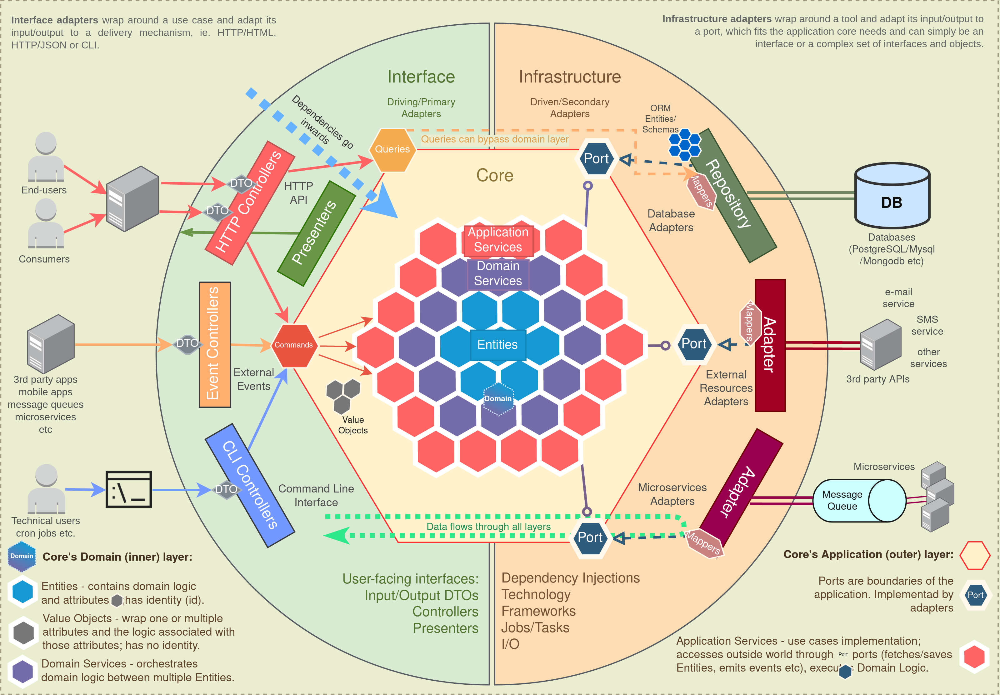

_**This repo is work in progress**_

# Clean Hexagon

Main emphasis of this project is to provide a guide on how to design complex applications. In this readme are presented some of the techniques, tools, best practices, architectural patterns and guidelines gathered from different sources.

**Everything below should be seen as a recommendation**. Keep in mind that different projects have different requirements, so any pattern mentioned in this readme can be replaced or skipped if needed.

This project uses [TypeScript](https://www.typescriptlang.org/) language, [NestJS](https://docs.nestjs.com/) framework and [Typeorm](https://www.npmjs.com/package/typeorm) for the database access.
Keep in mind that code examples are adapted to TypeScript and mentioned above frameworks so may not fit well for other languages.

Though patterns and principles presented here are **framework/language agnostic**, so above technologies can be easily replaced with any alternative. No matter what language or framework is used, any application can benefit from principles described below.

# Architecture

Mainly based on:

- [Domain-Driven Design (DDD)](https://en.wikipedia.org/wiki/Domain-driven_design)
- [Hexagonal (Ports and Adapters) Architecture ](https://blog.octo.com/en/hexagonal-architecture-three-principles-and-an-implementation-example/)
- [Clean Architecture](https://blog.cleancoder.com/uncle-bob/2012/08/13/the-clean-architecture.html)
- [Onion Architecture](https://herbertograca.com/2017/09/21/onion-architecture/)
- [SOLID Principles](https://en.wikipedia.org/wiki/SOLID)

Clean, Hexagonal and Onion architectures are not incompatible as some people think and are not competing with each other to see which one is better. All of them provide useful patterns that can be used in combination to achieve a better result.

- DDD principles are all about building application domain;
- Hexagonal Architecture is all about how application domain interacts with the rest of the world using Ports and Adapters;
- Onion architecture proposed separation of concerns by dividing application in layers;
- And Clean architecture is somewhat a combination of the above.

This architectures are very similar and pretty much compatible.

Before we begin, here are the PROS and CONS of using this approach:

## Pros:

- Independent of external frameworks, technologies, databases, etc. Frameworks and external resources can be plugged/unplugged with much less effort.
- Easily testable and scalable.
- The solution can be worked on and maintained by different teams, without stepping on each other's toes.
- Easier to add new features. As the system grows over time, the difficulty in adding new features remains constant and relatively small.
- If the solution is properly broken apart along [bounded context](https://martinfowler.com/bliki/BoundedContext.html) lines, it becomes easy to convert pieces of it into microservices if needed.

## Cons:

- This is a sophisticated architecture which requires a firm understanding of quality software principles, such as SOLID, Clean/Hexagonal Architecture, Domain-Driven Design, etc. Any team implementing such a solution will almost certainly require an expert to drive the solution and keep it from evolving the wrong way and accumulating technical debt.

- This approach is not recommended for small applications. There is added up-front complexity to support the architecture, such as more boilerplate code, abstractions, etc. thus this architecture is generally ill-suited to simple CRUD applications and could over-complicate such solutions.

# Diagram



In short, data flow looks like this (from left to right):

- Request/CLI command/event is sent to the controller using plain DTO;
- Controller parses this DTO, converts it to a Command/Query and passes it to a Application service;
- Application service handles this Command/Query; it executes business logic using domain services and/or entities and uses the infrastructure layer through ports;
- Infrastructure layer maps data to format that it needs, uses repositories to fetch/persist data and adapters to send events or do other I/O communications, maps data back to domain format and returns it back to Application service;
- After application service fishes doing it's job, it returns data/confirmation back to Controllers;
- Controllers return data back to the user (if application has presenters, presenters are returned instead).

More in details on each step below.

# Modules

This project's code examples use separation by modules (also called components). Each module is separated in parts and layers; Each module gets its own folder with a dedicated codebase; and each use case inside that module gets it's own folder to store most of the things it needs (this is also called _Vertical Slicing_).
It is easier to work on things that change together if those things are gathered relatively close to each other. Try not to create dependencies between modules or use cases, move shared logic into a separate files and make both depend on that instead of depending on each other.

Try to make every module independent and keep interactions between modules minimal. Think of each module as a mini application bounded by a single context. Interactions between modules can be done using events or public interfaces, try to avoid direct imports of other module's internal files. This approach ensures [loose coupling](https://en.wikipedia.org/wiki/Loose_coupling), and, if bounded contexts are defined and designed properly, each module can be easily separated into a microservice if needed.

A lof of people tend to create one module per entity, but this approach is not very good. Each module may have multiple entities. One thing to keep in mind is that putting entities in a single module requires those entities to have related business logic, don't group unrelated entities in one module.

Read more about modular programming benefits:

- [Modular programming: Beyond the spaghetti mess](https://www.tiny.cloud/blog/modular-programming-principle/).

# Application Core

This is the core of the system which is built using [DDD building blocks](https://dzone.com/articles/ddd-part-ii-ddd-building-blocks).

**Dependencies point inwards**. Outer layers can depend on inner layers, but inner layers never depend on outer layers.

Core layers shouldn't depend on frameworks or access external resources. Any external calls to out-of-process resources/retrieval of data from remote processes should be done through `ports` (interfaces), with class implementations created somewhere in infrastructure layer and injected into application's core ([Dependency Injection](https://en.wikipedia.org/wiki/Dependency_injection) and [Dependency Inversion](https://en.wikipedia.org/wiki/Dependency_inversion_principle)).

## Using libraries inside application's core and domain layers

Whether or not to use libraries in a core/domain is a subject of a lot of debates. In real world, injecting every library instead of importing it directly is not always practical, so exceptions can be made for some single responsibility libraries that help to implement domain logic (like number converting libraries etc). Read more: [referencing external libs](https://khorikov.org/posts/2019-08-07-referencing-external-libs/).

Main recommendations to keep in mind is that libraries imported in application's core/domain **shouldn't** expose:

- Functionality to access any out-of-precess resources (http calls, database access etc);
- Functionality not relevant to domain (frameworks, technology details like ORMs etc).
- Functionality that brings randomness (generating random IDs, timestamps etc) since this makes tests unpredictable (though in TypeScript world it is not that big of a deal since this can be mocked by a test library without using DI);

Also if a library changes often or has a lot of dependencies of its own it shouldn't be used in domain layer.

To use such libraries consider creating an `anti-corruption` layer by using [adapter](https://refactoring.guru/design-patterns/adapter) or [facade](https://refactoring.guru/design-patterns/facade) patterns.

Offload as much of irrelevant responsibilities as possible from the core and especially from domain layer.

Read more:

- [Anti-corruption Layer — An effective Shield](https://medium.com/@malotor/anticorruption-layer-a-effective-shield-caa4d5ba548c)

## Application's Core consists of:

### Domain layer:

- Entities
- Domain Services
- Value Objects

### Application layer:

- Application Services
- Commands and Queries
- Ports

This is just a short list the main things that may reside in here. More building blocks may be added if needed.

---

# Application layer

## Application Services

Are also called "Workflow Services", "User Cases", "Interactors" etc.
These services orchestrate the steps required to fulfill the commands imposed by the client.

- Typically used to orchestrate how the outside world interacts with your application and performs tasks required by the end users.
- Contain no domain-specific business logic;
- Operate on scalar types, transforming them into Domain types. A scalar type can be considered any type that's unknown to the Domain Model. This includes primitive types and types that don't belong to the Domain.
- Application services declare dependencies on infrastructural services required to execute domain logic (by using ports).
- Are used in order to fetch domain `Entities` (or anything else) from database/outside world through ports;
- Execute other out-of-process communications through `Ports` (like event emits, sending emails etc);
- In case of interacting with one Entity/Aggregate, executes its methods directly;
- In case of working with multiple Entities/Aggregates, uses a `Domain Service` to orchestrate them;
- Are basically a `Command`/`Query` handlers;
- Should not depend on other application services since it may cause problems (like cyclic dependencies);

One service per use case is considered a good practice.

<details>
<summary>What are "Use Cases"?</summary>

[wiki](https://en.wikipedia.org/wiki/Use_case):

> In software and systems engineering, a use case is a list of actions or event steps typically defining the interactions between a role (known in the Unified Modeling Language as an actor) and a system to achieve a goal.

Use cases are, simply said, list of actions required from an application.

---

</details>

More about services:

- [Domain-Application-Infrastructure Services pattern](https://badia-kharroubi.gitbooks.io/microservices-architecture/content/patterns/tactical-patterns/domain-application-infrastructure-services-pattern.html)
- [Services in DDD finally explained](https://developer20.com/services-in-ddd-finally-explained/)

<details>
<summary>Notes: Interfaces for each Use Case and Local DTOs</summary>

### Interfaces for each use case

Some people prefer having an interface for each use case (Driving Port), which `Application Service` implements and a `Controller` depends on. This is a viable option, but this project doesn't use interfaces for every use case for simplicity: it makes sense using interfaces when there are **multiple** implementations of a workflow, but use cases are too specific and should not have multiple implementations of the same workflow (**one** service per use case rule mentioned above). `Controllers` naturally depend on a concrete implementation thus making interfaces redundant. More on this topic [here](https://stackoverflow.com/questions/62818105/interface-for-use-cases-application-services).

### Local DTOs

Another thing that can be seen in some projects is local DTOs. Some people prefer never use domain objects (like entities) outside of core (in `controllers`, for example), and are using DTOs instead. This project doesn't use this technique to avoid extra interfaces and data mapping. Either to use local DTOs or not is a matter of taste.

[Here](https://martinfowler.com/bliki/LocalDTO.html) are Martin Fowler's thoughts on local DTOs, in short (quote):

> Some people argue for them(DTOs) as part of a Service Layer API because they ensure that service layer clients aren't dependent upon an underlying Domain Model. While that may be handy, I don't think it's worth the cost of all of that data mapping.

</details>

---

## Commands and Queries

This principle is called [Command–Query Separation(CQS)](https://en.wikipedia.org/wiki/Command%E2%80%93query_separation). When possible, methods should be separated into `Commands` (state-changing operations) and `Queries` (data-retrieval operations). To make a clear distinction between those two types of operations, input objects can be represented as `Commands` and `Queries`. Before DTO reaches the domain, it is converted into a `Command`/`Query` object.

### Commands

- `Commands` are used for state-changing actions, like creating new user and saving it to the database. Create, Update and Delete operations are considered as state-changing.

Data retrieval is responsibility of `Queries`, so `Command` methods should not return anything. Though, if needed, returning a bare minimum (like `ID` of a created item or a confirmation message) may not be a bad idea.

**Note**: `Command` has nothing to do with [Command Pattern](https://refactoring.guru/design-patterns/command), it is just a convenient name to represent that this object invokes a CQS Command. Both `Commands` and `Queries` in this example are just simple classes with data.

Example of command object: [create-user.command.ts](src/modules/user/use-cases/create-user/create-user.command.ts)

### Queries

- `Query` is used for retrieving data and should not make any state changes (like writes to the database, files etc).

Queries are usually just a data retrieval operation and have no business logic involved; so, if needed, application and domain layers can be bypassed completely. Though, if some additional non-state changing logic has to be applied before returning a query response (like calculating something), it should be done in a corresponding application service.

Validation also can be skipped, since no input is persisted in query operations. But, if needed, it can be validated to tell the user that query format is incorrect (when using enums for example).

Example of query bypassing application/domain layers completely: [find-user-by-email.http.controller.ts](src/modules/user/use-cases/find-user-by-email/find-user-by-email.http.controller.ts)

---

**Note**: Some simple cases may not need a `Command`/`Query` object, like find query or delete command may only need an ID so there is no point in creating an object for that.

Read more about CQS:

- [Martin Fowler blog](https://martinfowler.com/bliki/CommandQuerySeparation.html)
- [Command Query Segregation](https://khalilstemmler.com/articles/oop-design-principles/command-query-segregation/).

---

## Ports

Ports (for Driven Adapters) are interfaces that define contracts which must be implemented by infrastructure adapters in order to execute some action more related to technology details rather then business logic. Ports act like abstractions for technology details that business logic does not care about.

- Ports should be created to fit the Domain needs, not simply mimic the tools APIs.
- Mock implementations can be passed to ports while testing. Mocking makes your tests faster and independent from the environment.

Example file: [event-emitter.port.ts](src/core/ports/event-emitter.port.ts)

---

# Domain Layer

This layer contains application's business rules.

Domain should only operate using domain objects, most important ones are described below.

## Entities

Entities are the core of the domain. They encapsulate Enterprise wide business rules and attributes. An entity can be an object with methods, or it can be a set of data structures and functions.

Domain business logic goes here. Avoid having business logic in your services when possible, this leads to [Anemic Domain Model](https://martinfowler.com/bliki/AnemicDomainModel.html) (domain services are exception for business logic that can't be put in a single entity).

> Domain entities should always be valid entities. There are a certain number of invariants for an object that should always be true. For example, an order item object always has to have a quantity that must be a positive integer, plus an article name and price. Therefore, invariants enforcement is the responsibility of the domain entities (especially of the aggregate root) and an entity object should not be able to exist without being valid.

Entities:

- Have an identity that defines it and makes it distinguishable from others. It's identity is consistent during its life cycle.
- Equality between two entities is determined by comparing their identificators (usually its `id` field).
- Can contain other objects, such as other entities or value objects.
- Responsible for the coordination of operations on the objects it owns.
- Know nothing about other layers.
- Domain entities data should be modelled to accommodate business logic, not some database schema.
- Entities must protect their invariants, try to avoid public setters and update state using methods.
- Validate Entities and other domain objects on creation and throw an error on first failure. [Fail Fast](https://en.wikipedia.org/wiki/Fail-fast).

Example files:

- [user.entity.ts](src/modules/user/domain/entities/user.entity.ts)

Read more: [Domain Entity pattern](https://badia-kharroubi.gitbooks.io/microservices-architecture/content/patterns/tactical-patterns/domain-entity-pattern.html)

---

## Aggregates

[Aggregate](https://martinfowler.com/bliki/DDD_Aggregate.html) is a cluster of domain objects that can be treated as a single unit. It encapsulates entities and value objects which conceptually belong together. It also contains a set of operations which those domain objects can be operated on.

- Aggregates help to simplify the domain model by gathering multiple domain objects under a single abstraction.
- Aggregates should not be influenced by data model. Associations between domain objects are not the same as database relationships.
- Aggregate root is a gateway to entire aggregate. Any references from outside the aggregate should **only** go to the aggregate root.

Example files: // TODO

Read more:

- [Understanding Aggregates in Domain-Driven Design](https://dzone.com/articles/domain-driven-design-aggregate)

---

## Domain Services

Eric Evans, Domain-Driven Design:

> Domain services are used for "a significant process or transformation in the domain that is not a natural responsibility of an ENTITY or VALUE OBJECT"

- Domain Service is a specific type of domain layer class that is used to execute domain logic that relies on two or more `Entities`.
- Domain Services are used when putting the logic on a particular `Entity` would break encapsulation and require the `Entity` to know about things it really shouldn't be concerned with.
- Domain services are very granular where as application services are a facade purposed with providing an API.
- Domain services operate only on types belonging to the Domain. They contain meaningful concepts that can be found within the Ubiquitous Language. They hold operations that don't fit well into Value Objects or Entities.

---

## Value objects

Some Attributes and behaviors can be moved out of the entity itself and put into `Value Objects`.

Value Objects:

- Have no identity. Equality is determined through structural property.
- Are immutable.
- Can be used as an attribute of `entities` and other `value objects`.
- Explicitly defines and enforces important constraints (invariants).

Value object shouldn’t be just a convenient grouping of attributes but should form a well-defined concept in the domain model. This is true even if it contains only one attribute. When modeled as a conceptual whole, it carries meaning when passed around, and it can uphold its constraints.

Imagine you have a `User` entity which needs to have an `address` of a user. Usually an address is simply a complex value that has no identity in the domain and is composed of multiple other values, like `country`, `street`, `postalCode` etc; so it can be modeled and treated as a `Value Object` with it's own business logic.

`Value object` isn’t just a data structure that holds values. It can also encapsulate logic associated with the concept it represents.

Equality of `Value Objects` can be checked using `equals` method:

```typescript
user1.address.equals(user2.address);
```

Example files:

- [address.value-object.ts](src/modules/user/domain/value-objects/address.value-object.ts)

Read more about Value Objects:

- [Martin Fowler blog](https://martinfowler.com/bliki/ValueObject.html)
- [Value Objects to the rescue](https://medium.com/swlh/value-objects-to-the-rescue-28c563ad97c6).
- [Value Object pattern](https://badia-kharroubi.gitbooks.io/microservices-architecture/content/patterns/tactical-patterns/value-object-pattern.html)

## Enforcing invariants of Domain Objects

### Replacing primitives with Value Objects

Most of the code bases operate on primitive types – `strings`, `numbers` etc. In the Domain Model, this level of abstraction is definitely too low.

Significant business concepts should be expressed using specific types and classes. `Value Objects` can be used instead primitives to avoid [primitives obsession](https://refactoring.guru/smells/primitive-obsession).
So, for example, `email` of type `string`:

```typescript
email: string;
```

can be represented as a `Value Object` instead:

```typescript
email: Email;
```

Now the only way to make an `email` is to create a new instance of `Email` class first, this ensures it will be validated on creation and a wrong value won't get into `Entities`.

Creating an object for every primitive value may be cumbersome, but it somewhat forces a developer to study domain more in details instead of just throwing a primitive type without even thinking what that value represents in domain.

Using `Value Objects` for primitive types is also called a `domain primitive`. The concept and naming are proposed in the book ["Secure by Design"](https://www.manning.com/books/secure-by-design).

Using `Value Objects` instead of primitives:

- Makes code easier to understand by using [ubiquitous language](https://martinfowler.com/bliki/UbiquitousLanguage.html) instead of just `string`.
- Leads to a better design.
- Improves security by ensuring invariants of every property.

Example files:

- [email.value-object.ts](src/modules/user/domain/value-objects/email.value-object.ts)

Recommended to read:

- [Developing the ubiquitous language](https://medium.com/@felipefreitasbatista/developing-the-ubiquitous-language-1382b720bb8c)
- [Primitive Obsession — A Code Smell that Hurts People the Most](https://medium.com/the-sixt-india-blog/primitive-obsession-code-smell-that-hurt-people-the-most-5cbdd70496e9)

**Use Value Objects and Types system to make illegal states unrepresentable in your program.**

Quote from [John A De Goes](https://twitter.com/jdegoes):

> Making illegal states unrepresentable is all about statically proving that all runtime values (without exception) correspond to valid objects in the business domain. The effect of this technique on eliminating meaningless runtime states is astounding and cannot be overstated.

Lets distinguish two types of protection from illegal states: at **compile time** and at **runtime**.

### At compile time

Types give useful semantic information to a developer. Good code should be easy to use correctly, and hard to use incorrectly. Types system can be a good help for that. It can prevent some nasty errors at a compile time, so IDE will show type errors right away.

The simplest example may be using enums instead of constants, for example: [events.ts](src/core/events/events.ts). This file has enums of events that can occur in a program. Now, event emitter port [event-emitter.port.ts](src/core/ports/event-emitter.port.ts) uses that events type to prevent illegal types pass. If you try to pass anything that is not intended it will show type error.

More importantly, this approach can be used to make business logic safer.

For example, imagine that business logic requires to have contact info of a person by either having `email`, or `phone`, or both. Both `email` and `phone` could be represented as optional, for example:

```typescript
interface ContactInfo {
  email?: Email;
  phone?: Phone;
}
```

But what happens if both are not provided by a programmer? Business rule violated. Illegal state allowed.

Solution: this could be presented as a [union type](https://www.typescriptlang.org/docs/handbook/unions-and-intersections.html#union-types)

```typescript
type ContactInfo = Email | Phone | [Email, Phone];
```

Now only either `Email`, or `Phone`, or both must be provided. If nothing is provided IDE will show a type error right away. This is a business rule validation used at **compile time**.

### At runtime

Things that can't be validated at compile time (like user input) are validated at runtime.

Domain objects have to protect their invariants. Having some validation rules here will protect their state from corruption.

`Value Object` can represent a typed value in domain. The goal here is to encapsulate validations and business logic related only to the represented fields and make it impossible to pass around raw values by forcing a creation of valid `Value Objects` first. This object only accepts values which make sense in its context.

If every argument and return value of a method is valid by definition, you’ll have input and output validation in every single method in your codebase without any extra effort. This will make application more resilient to errors and will protect it from a whole class of bugs and security vulnerabilities caused by invalid input data.

Data should not be trusted. There are a lot of cases when invalid data may end up in a domain. For example, if data comes from external API, database, or if it's just a programmer error.

- External APIs may return corrupted data;
- Database may return incorrect data when someone modifies it manually (especially when there are some admin panels that allow to do that);
- Programmer may create objects with incorrect input by accident: `new Email(someRandomString)`.

Enforcing self-validation will inform immediately when `Value Object` is created with corrupted data. Not validating domain objects allows them to be in an incorrect state, this leads to problems.

There are some general recommendations for validation order. Cheap operations like checking for null/undefined and checking length of data come early in the list, and more expensive operations that require calling the database come later.

**Types of validation, preferably in this order:**

- _Origin - Is the data from a legitimate sender?_ When possible, accept data only from authorized users / whitelisted IPs etc. depending on the situation.
- _Existence - are provided data not empty?_ Further validations make no sense if data is empty. Check for empty values: null/undefined, empty objects and arrays.
- _Size - Is it reasonably big?_ Before any further steps, check length/size of input data, no matter what type it is. This will prevent validating data that is too big which may block a thread entirely (sending data that is too big may be a DDoS attack).
- _Lexical content - Does it contain the right characters and encoding?_ For example, if we expect data that only contains digits, we scan it to see if there’s anything else. If we find anything else, we draw the conclusion that the data is either broken by mistake or has been maliciously crafted to fool our system.
- _Syntax - Is the format right?_ Check if data format is right. Sometimes checking syntax is as simple as using a regexp, or it may be more complex like parsing a XML or JSON.
- _Semantics - Does the data make sense?_ Check data in connection with the rest of the system (like database, other processes etc). For example, checking in a database if ID of item exists.

Read more about validation types described above: ["Secure by Design" Chapter 4.3: Validation](https://livebook.manning.com/book/secure-by-design/chapter-4/109)

For validation like checking for nulls, empty arrays, input length etc. a library of [guards](<https://en.wikipedia.org/wiki/Guard_(computer_science)>) can be created.

Example file: [guard.ts](src/core/guard.ts)

Read more: [Refactoring: Guard Clauses](https://medium.com/better-programming/refactoring-guard-clauses-2ceeaa1a9da)

Another solution would be using an external validation library, but it is not a good practice to tie domain to external libraries and is not usually recommended. Custom validation probably won't be as good as validation library, but it can be **good enough** to protect from a lot of potential errors and avoid tying domain to external libraries.

Although exceptions can be made if needed, especially for very specific validation libraries that validate only one thing (like specific IDs, for example bitcoin wallet address). Tying only one or just few `Value Objects` to such a specific library won't cause any harm. Unlike general purpose validation libraries which will be tied to domain everywhere and it will be troublesome to change it in every `Value Object` in case when old library is no longer maintained, contains critical bugs or is compromised by hackers etc.

Though, it is perfectly fine to do full sanity checks using validation framework or library **outside** of domain (for example `class-validator` decorators in `DTOs`), and do only some basic checks inside of `Value Objects` (besides business rules), like checking for `null` or `undefined`, checking length, matching against simple regexp etc. to check if value makes sense and for extra security.

<details>
<summary>Note about using regexp</summary>

Be careful with custom regexp validations for things like validating `email`, only use custom regexp for some very simple rules and, if possible, let validation library do it's job on more difficult ones to avoid problems in case your regexp is not good enough.

Also, keep in mind that custom regexp that does same type of validation that is already done by validation library outside of domain may create conflicts between your regexp and the one used by a validation library.

For example, value can be accepted as valid by a validation library, but `Value Object` may throw an error because custom regexp is not good enough (validating `email` is more complex then just copy - pasting a regular expression found in google. Though, it can be validated by a simple rule that is true all the time and won't cause any conflicts, like every `email` must contain an `@`). Try finding and validating only patterns that won't cause conflicts.

---

</details>

Either to use external library/framework for validation inside domain or not is a tradeoff, analyze all the pros and cons and choose what is more appropriate for current application.

**Keep in mind** that not all validations can be done in a single `Value Object`, it should validate only rules shared by all contexts. There are cases when validation may be different depending on a context, or one field may involve another field, or even a different entity. Handle those cases accordingly.

**Recommended to read**:

- [Making illegal states unrepresentable](https://v5.chriskrycho.com/journal/making-illegal-states-unrepresentable-in-ts/)
- [Domain Primitives: what they are and how you can use them to make more secure software](https://freecontent.manning.com/domain-primitives-what-they-are-and-how-you-can-use-them-to-make-more-secure-software/)
- ["Secure by Design" Chapter 5: Domain Primitives](https://livebook.manning.com/book/secure-by-design/chapter-5/) (a full chapter of the article above)
- [Value Objects Like a Pro](https://medium.com/@nicolopigna/value-objects-like-a-pro-f1bfc1548c72)

---

## Other DDD topics

- [Domain Event pattern](https://badia-kharroubi.gitbooks.io/microservices-architecture/content/patterns/tactical-patterns/domain-event-pattern.html)

---

# Interface Adapters

Interface adapters (also called driving/primary adapters) are user-facing interfaces that take input data from the user and repackage it in a form that is convenient for the use cases(services) and entities. Then they take the output from those use cases and entities and repackage it in a form that is convenient for displaying it back for the user. User can be either a person using an application or another server.

Contains `Controllers` and `Request`/`Response` DTOs

## Controllers

Controllers are used for triggering use cases and presenting the result.

One controller per use case is considered a good practice.

Also, one controller per trigger type can be used. For example:

- [create-user.http.controller.ts](src/modules/user/use-cases/create-user/create-user.http.controller.ts) for http requests ([NestJS Controllers](https://docs.nestjs.com/controllers)),
- [create-user.cli.controller.ts](src/modules/user/use-cases/create-user/create-user.cli.controller.ts) for command line interface access ([NestJS Console](https://www.npmjs.com/package/nestjs-console))
- `events controller` for external events ([NetJS Microservices](https://docs.nestjs.com/microservices/basics)).
- etc.

---

## DTOs

Data Transfer Object ([DTO](https://en.wikipedia.org/wiki/Data_transfer_object)) is an object that carries data between processes.

### Request DTOs

Input data sent by a user. May consists of request classes and interfaces.

Examples:

- [create-user.request.dto.ts](src/modules/user/use-cases/create-user/create-user.request.dto.ts)
- [create.user.interface.ts](src/interface-adapters/interfaces/user/create.user.interface.ts)

### Response DTOs

Output data returned to a user. May consist of a `Request`/`Response` class, interface and/or mapper.

### Additional recommendations:

- When returning a `Response` prefer _whitelisting_ properties over _blacklisting_ using mapper (or right in the `Response` class in some cases). This ensures that no sensitive data will leak in case if programmer forgets to blacklist newly added properties that shouldn't be returned to the user.
- Interfaces for `Request`/`Response` objects should be kept somewhere in shared directory instead of module directory since they may be used by a different application (like front-end page, mobile app or microservice). Consider creating git submodule or a separate package for sharing interfaces.
- `Request`/`Response` DTO classes may be a good place to use validation and sanitization decorators like [class-validator](https://www.npmjs.com/package/class-validator) and [class-sanitizer](https://www.npmjs.com/package/class-sanitizer) (make sure that all validation errors are gathered first and only then return them to the user, this is called [Notification pattern](https://martinfowler.com/eaaDev/Notification.html). Class-validator does this by default).
- `Request`/`Response` DTO classes may also be a good place to use Swagger/OpenAPI library decorators that [NestJS provides](https://docs.nestjs.com/openapi/types-and-parameters).
- If class decorators for validation/swagger are not used, creating a class may be omitted and interface/mapper should be enough.

Examples:

- [user.response.dto.ts](src/modules/user/dtos/user.response.dto.ts)
- [user.interface.ts](src/interface-adapters/interfaces/user/user.interface.ts)

---

# Infrastructure

The Infrastructure is responsible strictly to keep technology. You can find there the implementations of database repositories for business entities, message brokers, I/O components, dependency injection, frameworks and any other thing that represents a detail for the architecture, mostly framework dependent, external dependencies, and so on.

It's the most volatile layer. Since the things in this layer are so likely to change, they are kept as far away as possible from the more stable domain layers. Because they are kept separate, it's relatively easy make changes or swap one component for another.

Infrastructure adapters (also called driven/secondary adapters) enable a software system to interact with external systems by receiving, storing and providing data when requested (like persistence, message brokers, sending emails or messages, requesting 3rd party APIs etc).

Adapters are essentially an implementation of ports. They are not supposed to be called directly in any point in code, only through ports(interfaces).

## Database

This folder contains all database related files:
`Repositories`, `Orm Entities`, `Migrations`, `Seeds` and `Seeders` etc.

## Repositories

Repositories centralize common data access functionality. They encapsulate the logic required to access that data. Entities/aggregates can be put into a repository and then retrieved at a later time without domain even knowing where data is saved, in a database, or a file, or some other source.

We use repositories to decouple the infrastructure or technology used to access databases from the domain model layer.

Martin Fowler describes a repository as follows:

> A repository performs the tasks of an intermediary between the domain model layers and data mapping, acting in a similar way to a set of domain objects in memory. Client objects declaratively build queries and send them to the repositories for answers. Conceptually, a repository encapsulates a set of objects stored in the database and operations that can be performed on them, providing a way that is closer to the persistence layer. Repositories, also, support the purpose of separating, clearly and in one direction, the dependency between the work domain and the data allocation or mapping.

The data flow here looks something like this: repository receives a domain `Entity` from application service, maps it to database schema/ORM format, does required operations and maps it back to domain `Entity` and returns it back to service.

**Keep in mind** that application's core is not allowed to depend on repositories directly, instead it depends on abstractions (ports/interfaces). This makes data retrieval technology-agnostic.

### Examples

This project contains abstract repository class that allows to make basic CRUD operations: [repository.base.ts](src/infrastructure/database/base-classes/repository.base.ts). This base class is then extended by a specific repository, and all specific operations that an entity may need is implemented in that specific repo: [user.repository.ts](src/modules/user/database/user.repository.ts).

## ORM Entities

Using a single entity for domain logic and database concerns leads to a database-centric architecture. In DDD world those two should be separated. If ORM frameworks are used, `ORM Entities` can be created to represent domain entities in a database.

Since domain `Entities` have their data modeled so that it best accommodates domain logic, it may be not in the best shape to save in database. For that purpose `ORM Entities` are used that have shape that is better represented in a particular database that is used.

`ORM Entities` should also have a corresponding mapper to map from domain to persistence and back.

Example files:

- [user.orm-entity.ts](src/modules/user/database/user.orm-entity.ts)
- [user.orm-mapper.ts]() // TODO

Read more:

- [Stack Overflow question: DDD - Persistence Model and Domain Model](https://stackoverflow.com/questions/14024912/ddd-persistence-model-and-domain-model)
- [Just Stop It! The Domain Model Is Not The Persistence Model](https://blog.sapiensworks.com/post/2012/04/07/Just-Stop-It!-The-Domain-Model-Is-Not-The-Persistence-Model.aspx)

## Seeds

To avoid manually creating data in the database, seeding is a great solution to populate database with data for development and testing purposes (e2e testing). [Wiki description](https://en.wikipedia.org/wiki/Database_seeding)

This project uses [typeorm-seeding](https://www.npmjs.com/package/typeorm-seeding#-using-entity-factory) package. Files like: `Seeds`, `Seeders` and `Factories` are used by this package to seed the database.

## Migrations

Migrations are used for database table/schema changes:

> Database migration refers to the management of incremental, reversible changes and version control to relational database schemas. A schema migration is performed on a database whenever it is necessary to update or revert that database's schema to some newer or older version.

[Wiki](https://en.wikipedia.org/wiki/Schema_migration)

This project uses [Typeorm Migrations](https://github.com/typeorm/typeorm/blob/master/docs/migrations.md) as an example.

---

# Adapters

Adapters implementations for accessing external APIs.

Adapters should have:

- a `port` somewhere in domain layer that it implements;
- a mapper that maps data **from** and **to** domain (if it's needed);
- a DTO/interface for received data;
- a validator to make sure incoming data is not corrupted (validation can reside in DTO class using decorators).

## Other

Other infrastructure related things:

- Framework related files;
- Application logger implementation;
- Periodic cron jobs or tasks launchers ([NestJS Schedule](https://docs.nestjs.com/techniques/task-scheduling));
- Internal events handlers for infrastructure operations ([Nest-event](https://www.npmjs.com/package/nest-event));
- Other technology related files.

---

# Error Handling

## Exception types

Consider making different exception types for different situations. For example, an `ValidationException`, `NotFoundException` etc.

Keep in mind that your application's `core` shouldn't throw HTTP exceptions or statuses since it shouldn't know anything about where it is used, since `core` can be used by anything: HTTP, Microservice, CLI etc. To return proper HTTP code back to user an `instanceof` check can be used in exception interceptor and appropriate HTTP exception can be returned depending on exception type.

Exception interceptor example: [exception.interceptor.ts](src/infrastructure/interceptors/exception.interceptor.ts)

Adding a `name` string with type name for every exception is a good practice, since when that exception is transferred to another process `instanceof` check cannot be made anymore so a `name` string is used instead. Store exception `name` enum types in a separate file so they can be reused on a receiving side.

When using microservices, all exceptions can be packed as a submodule and reused in each microservice for consistency.

### Differentiate between programmer errors and user input errors

For example:

- When validation error is thrown by validating user input, it means that this input is incorrect and a `400 Bad Request Exception` should be returned with details of what fields are incorrect ([notification pattern](https://martinfowler.com/eaaDev/Notification.html)). In this project's code examples it's done automatically in DTOs by `class-validator` library.
- When validation exception happens on a new `Value Object` creation that usually means a programmer did a mistake by assigning an incorrect value to a constructor, so a different type of error should be thrown here which later should be converted into `500 Internal Server Error`, in this case without adding additional info since it may cause a leak of some sensitive data.

Application should be protected not only from incorrect user input but from a programmer errors as well by throwing exceptions when something is not used as intended. No details should be returned to the user in case of programmer errors since those details may contain some sensitive information about the program.

## Error Serialization

By default, Error objects serialize to JSON with output like this:

```typescript
{
  name: 'ValidationError';
}
```

Consider serializing errors by creating a `toJSON()` method so it can be easily sent to other processes as a plain object.

- Exception abstract base class example: [exception.base.ts](src/core/exceptions/exception.base.ts)
- Validation Exception class example: [validation.exception.ts](src/core/exceptions/validation.exception.ts)

Read more:

- [Better error handling in JavaScript](https://iaincollins.medium.com/error-handling-in-javascript-a6172ccdf9af)
- ["Secure by design" Chapter 9: Handling failures securely](https://livebook.manning.com/book/secure-by-design/chapter-9/)

---

# Testing

Testing each file and method separately is called [White Box](https://en.wikipedia.org/wiki/White-box_testing) testing (like entity tests, domain services tests etc). It creates coupling to implementation details, so every time you decide to refactor something this may also cause refactoring corresponding tests.

To solve this and get the most out of your tests, prefer [Black Box](https://en.wikipedia.org/wiki/Black-box_testing) testing (also called [Behavioral Testing](https://www.codekul.com/blog/what-is-behavioral-testing/)). This means that tests should focus on testing user-facing behavior users care about (your code's public API, for example `createUser()` method in `Application Service`), not the implementation details of individual units it has inside. This avoids coupling, protects tests from changes that may happen while refactoring, makes tests easier to understand and maintain thus saving time.

Try to avoid _White Box_ testing when possible. Though, there are cases when _White Box_ testing may be needed, like:

- There is a need to increase code coverage;
- High complexity in implementation details that are hard to cover using _Black Box_ testing;
- There is a suspicion that some area of the program may be under-tested, etc.

Use _White Box_ testing only when it is really needed and as an addition to _Black Box_ testing, not the other way around.

It's all about investing only in the tests that yield the biggest return on your effort.

Read more:

- [Pragmatic unit testing](https://enterprisecraftsmanship.com/posts/pragmatic-unit-testing/)
- [Google Blog: Test Behavior, Not Implementation ](https://testing.googleblog.com/2013/08/testing-on-toilet-test-behavior-not.html)
- [Writing BDD Test Scenarios](https://www.departmentofproduct.com/blog/writing-bdd-test-scenarios/)

Example files: // TODO

- Spec file for a use case in isolation: [TODO]();
- e2e testing a use case from end-user standpoint (with all the infrastructure up, like API routes, databases etc): [TODO]().

# Decorators

Decorators can add some useful functionality that may improve application architecture.

It's even possible to bring some functionality from other languages that is not available by default. Here are some examples for TypeScript:

### "Final" decorator

In TypeScript, unlike other languages, there is no default way to make a class `final`. But there is a way around it using a custom decorator.

Example file: [final.decorator.ts](src/core/decorators/final.decorator.ts)

Read more:

- [When to declare classes final](https://ocramius.github.io/blog/when-to-declare-classes-final/)
- [Final classes by default, why?](https://matthiasnoback.nl/2018/09/final-classes-by-default-why/)

### "Frozen" decorator

Some properties on a class or its prototype can be changed from outside without any error, which may cause bugs. This can be prevented using a custom class decorator.

Example file: [frozen.decorator.ts](src/core/decorators/frozen.decorator.ts)

# Folder/File Structure

So instead of using typical layered style when all application is divided into services, controllers etc, we divide everything by modules. Now, how to structure files inside those modules?

A lot of people tend to do the same thing as before: create a separate folders for services, controllers etc and keep all the use-cases there. This is the same approach that makes navigation harder.

Using this approach, every time something in service changes, we might have to go to another folder to change controllers, and then go to dtos folder to change the corresponding dto etc.

It would be more logical to separate every module by components and have all the related files close together. Now if a use-case changes, those changes are usually made in a single use-case component, not everywhere across the module.

This is called [The Common Closure Principle (CCP)](https://ericbackhage.net/clean-code/the-common-closure-principle/). Folder/file structure in this project uses this principle. Related files that usually change together (and are not used by anything else outside of that component) are stored close together, in a single use-case folder.

And shared files (like domain objects, repositories etc) are stored apart since those are reused by multiple use-cases. Domain layer is isolated, and use-cases which are essentially wrappers around business logic are treated as components. This approach makes navigation and maintaining easier.

> The aim here should to be strategic and place classes that we, from experience, know often changes together into the same component.

Keep in mind that this project's folder/file structure is an example and might not work for everyone. Main recommendations here are:

- Separate you application into modules;
- Keep files that change together close to each other (Common Closure Principle);
- Group files by their behavior that changes together, not by type of functionality that file provides;
- Keep files that are reused by multiple components apart;
- Respect boundaries in your code, keeping files together doesn't mean lower layers can import upper layers;
- Try to avoid a lot of nested folders;
- [Move files around until it feels right](https://dev.to/dance2die/move-files-around-until-it-feels-right-2lek).

There are different approaches to file/folder structuring, like explicitly separating each layer into a corresponding folder. This defines boundaries more clearly but is harder to navigate. Choose what suits better for the project/personal preference.

Files in this project are named according to [Angular Style Guides](https://angular.io/guide/styleguide#separate-file-names-with-dots-and-dashes).

# Tools

## Linting

[Eslint](https://www.npmjs.com/package/eslint) with [typescript-eslint plugin](https://www.npmjs.com/package/@typescript-eslint/eslint-plugin) and some rules (like [airbnb](https://www.npmjs.com/package/eslint-config-airbnb)) can be a great tool to enforce writing better code. Consider disallowing things like `any` type and other things that may cause problems. Also, enabling strict mode in `tsconfig` is recommended.

## Code formatting

Consider using code formatters like [Prettier](https://www.npmjs.com/package/prettier) to maintain same code styles in the project.

## Pre-push/pre-commit hooks

Consider launching tests/code formatting/linting every time you do `git push` or `git commit`. This prevents bad code getting in your repo. [Husky](https://www.npmjs.com/package/husky) is a great tool for that.

## Code Generation

Code generation can be important when using complex architectures to avoid typing boilerplate code manually.

[Hygen](https://www.npmjs.com/package/hygen) is a great example.
This tool can generate building blocks (or entire modules) by using custom templates. Templates can be designed to follow best practices and concepts based on Clean/Hexagonal Architecture, DDD, SOLID etc.

Main advantages of automatic code generation are:

- Avoid manual typing or copy-pasting of boilerplate code.
- No hand-coding means less errors and faster implementations. Simple CRUD module can be generated and used right away in seconds without any manual code writing.
- Using auto-generated code templates ensures that everyone in the team uses the same folder/file structures, name conventions, architectural and code styles.

**Note**:

- To really understand and work with generated templates you need to understand what is being generated and why, so full understanding of an architecture and patterns used is required.

## Conventional commits

Conventional commits add some useful prefixes to your commit messages, for example:

- `feat: added ability to delete user's profile`

Read more:

- [conventionalcommits.org](https://www.conventionalcommits.org/en/v1.0.0-beta.2/)
- [Github Gist](https://gist.github.com/joshbuchea/6f47e86d2510bce28f8e7f42ae84c716)
- [Commitlint](https://github.com/conventional-changelog/commitlint)

---

# Additional resources

## Articles

- [DDD, Hexagonal, Onion, Clean, CQRS, … How I put it all together](https://herbertograca.com/2017/11/16/explicit-architecture-01-ddd-hexagonal-onion-clean-cqrs-how-i-put-it-all-together)
- [Clean architecture series](https://medium.com/@pereiren/clean-architecture-series-part-1-f34ef6b04b62)
- [Clean architecture for the rest of us](https://pusher.com/tutorials/clean-architecture-introduction)
- [Hexagonal Architecture](https://www.qwan.eu/2020/08/20/hexagonal-architecture.html)
- [Node.js Best Practices](https://github.com/goldbergyoni/nodebestpractices)

## Videos

- [More Testable Code with the Hexagonal Architecture](https://youtu.be/ujb_O6myknY)

## Books

- ["Domain-Driven Design: Tackling Complexity in the Heart of Software" ](https://www.amazon.com/Domain-Driven-Design-Tackling-Complexity-Software/dp/0321125215) by Eric Evans
- ["Implementing Domain-Driven Design"](https://www.amazon.com/Implementing-Domain-Driven-Design-Vaughn-Vernon/dp/0321834577) by Vaughn Vernon
- ["Secure by Design"](https://www.manning.com/books/secure-by-design) by Dan Bergh Johnsson, Daniel Deogun, Daniel Sawano
- ["Clean Architecture: A Craftsman's Guide to Software Structure and Design"](https://www.amazon.com/Clean-Architecture-Craftsmans-Software-Structure/dp/0134494164/ref=sr_1_1?dchild=1&keywords=clean+architecture&qid=1605343702&s=books&sr=1-1) by Robert Martin
